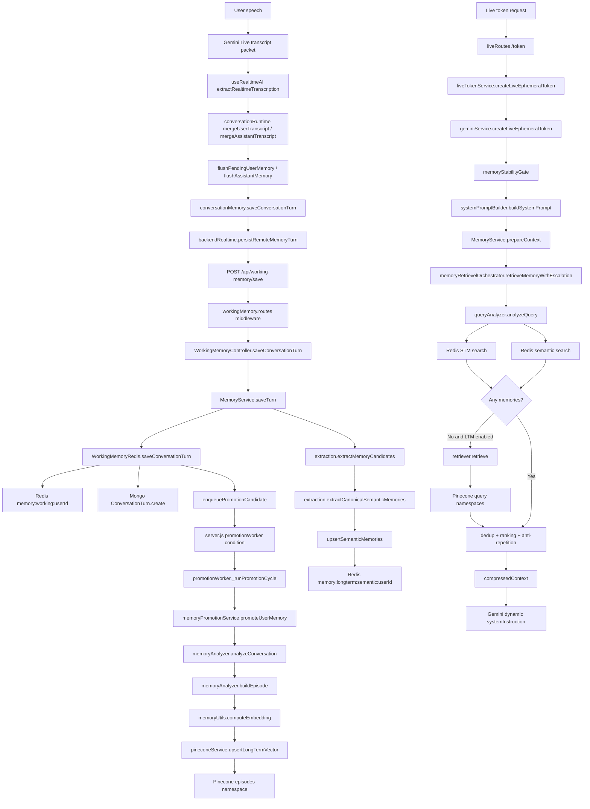
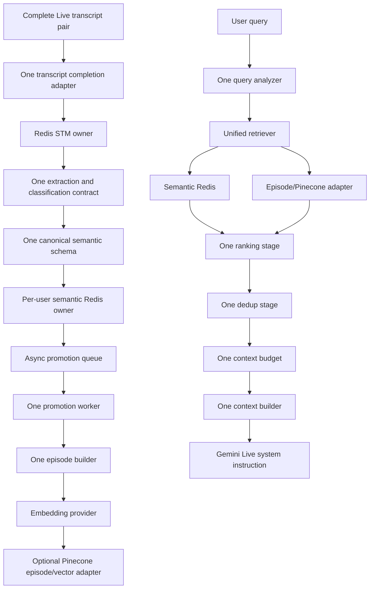

# KIARA ACTUAL MEMORY FLOW

**Repository:** `D:\Kiara`
**Audit date:** 2026-08-20
**Scope:** Current filesystem and current call graph under `Kiara-ai/` and `kiara-server/`, including startup, routes, controllers, services, workers, scripts, tests, and frontend callers.

**Code changes:** None. No source file was modified, fixed, or deleted. This is a runtime-flow map, not a design proposal or implementation change.

## How to read this report

The report distinguishes actual reachability from comments, filenames, documentation, and intended architecture.

- **[ACTIVE RUNTIME]**: reachable from the current Live/frontend or backend startup path.
- **[TEST ONLY]**: reached by an executable validation or test path, but not by normal Live runtime.
- **[LEGACY]**: old, placeholder, archived, or pre-existing parallel code that is still present or referenced but is not the current Live owner.
- **[UNKNOWN]**: static analysis cannot establish whether an external/manual entry point reaches it.

The working tree already contains pre-existing deletions of many old V6/V7, `MemoryProfile`, `LongTermMemory`, `/api/memory`, and old bootstrap files. Those absent files are discussed only as absent historical paths; they are not treated as current runtime paths.

---

## 1. Current runtime in one view

### Current Live write path

```text
User speech
  -> Gemini Live client transcript packets
  -> extractRealtimeTranscription()
  -> mergeUserTranscript() / mergeAssistantTranscript()
  -> flushPendingUserMemory() and flushAssistantMemory()
  -> conversationMemory.saveConversationTurn()
  -> backendRealtime.persistRemoteMemoryTurn()
  -> POST /api/working-memory/save
  -> workingMemory.routes.js middleware
  -> WorkingMemoryController.saveConversationTurn()
  -> MemoryService.saveTurn()
  -> WorkingMemoryRedis.saveConversationTurn()
  -> Redis memory:working:<userId>
  -> Mongo ConversationTurn backup
  -> Redis promotion queue
  -> MemoryService inline extraction/canonicalization
  -> Redis memory:longterm:semantic:<userId>
  -> optional promotionWorker
  -> memoryAnalyzer / buildEpisode / computeEmbedding / Pinecone
```

### Current Live read/prompt path

```text
Live token request or token refresh with userQuery
  -> liveRoutes.js
  -> liveTokenService.js
  -> geminiService.createLiveEphemeralToken()
  -> memory stability gate
  -> systemPromptBuilder.buildSystemPrompt()
  -> MemoryService.prepareContext()
  -> memoryRetrievelOrchestrator.retrieveMemoryWithEscalation()
  -> Query Analyzer
  -> Redis STM search
  -> Redis semantic hash search
  -> optional Pinecone retriever only when no memories were found
  -> optional deep search stub, which returns []
  -> deduplication
  -> relevance ranking
  -> anti-repetition filtering
  -> compressed context
  -> Gemini Live system instruction
```

The standalone `retriever.js` is active, but it is not the complete Live retrieval owner. The Live owner is `MemoryService.prepareContext()` plus `memoryRetrievelOrchestrator.js`.

---

# PART 1 - TRACE FROM LIVE USER INPUT

## 1.1 User speech -> transcript packets

**[ACTIVE RUNTIME]**

**FILE:** `Kiara-ai/src/components/context/hooks/useRealtimeAI.ts`

**FUNCTION:** The active realtime message handling path around `extractRealtimeTranscription(message)`.

**CALLER:** Gemini Live realtime callback/message handler in `useRealtimeAI`.

**CALLEE:** `extractRealtimeTranscription(message)` from `Kiara-ai/src/ai/transcription.ts`.

**INPUT:** Gemini Live server messages containing user and/or assistant transcript text.

**OUTPUT:** A packet with `userText` and/or `assistantText`.

**CONDITION:** Only transcript text present in the received Live message is processed.

## 1.2 Transcript packet -> accumulated transcript

**[ACTIVE RUNTIME]**

**FILE:** `Kiara-ai/src/components/context/hooks/useRealtimeAI.ts`

**FUNCTIONS:** `mergeUserTranscript(conversationRef.current, packet.userText)` and `mergeAssistantTranscript(conversationRef.current, packet.assistantText)`.

**CALLER:** The active realtime transcription handler.

**CALLEE:** `Kiara-ai/src/ai/conversationRuntime.ts`.

**INPUT:** Incremental transcript chunks.

**OUTPUT:** `conversationRef.current.userTranscript` and `conversationRef.current.assistantTranscript`.

**CONDITION:** A packet must contain the relevant role text. `mergeTranscript()` trims, replaces a contained transcript with the longer form, avoids duplicate overlap, and otherwise appends chunks with a space.

## 1.3 Assistant transcript arrival -> user transcript flush

**[ACTIVE RUNTIME]**

**FILE:** `Kiara-ai/src/components/context/hooks/useRealtimeAI.ts`

**FUNCTION:** `flushPendingUserMemory(conversationRef.current)`.

**CALLER:** The assistant-text branch immediately after an `assistantText` packet is received.

**CALLEE:** `Kiara-ai/src/ai/conversationRuntime.ts` -> `saveConversationTurn('user', userTranscript)`.

**INPUT:** The accumulated user transcript.

**OUTPUT:** The user transcript is passed to `conversationMemory.saveConversationTurn()` and cleared first.

**CONDITION:** The accumulated user transcript must be non-empty. The call is fire-and-forget in this handler (`void ...`).

## 1.4 Speech completion -> assistant transcript flush

**[ACTIVE RUNTIME]**

**FILE:** `Kiara-ai/src/components/context/hooks/useRealtimeAI.ts`

**FUNCTION:** `flushAssistantMemory(conversationRef.current)` from the `onSpeechComplete` callback.

**CALLER:** Audio output/speech completion callback.

**CALLEE:** `Kiara-ai/src/ai/conversationRuntime.ts` -> `saveConversationTurn('assistant', cleanAssistantText)`.

**INPUT:** Accumulated assistant transcript after `stripEmotionEnvelope()`.

**OUTPUT:** The assistant transcript is passed to `conversationMemory.saveConversationTurn()` and cleared first.

**CONDITION:** Assistant transcript must be non-empty and must remain non-empty after emotion-envelope stripping. The call is fire-and-forget (`void ...`).

A second `flushPendingUserMemory()` is also called on the audio error/completion fallback branch, so user persistence can be attempted again when output speech does not complete normally.

## 1.5 Role memory -> paired remote turn

**[ACTIVE RUNTIME]**

**FILE:** `Kiara-ai/src/ai/conversationMemory.ts`

**FUNCTION:** `saveConversationTurn(role, text)`.

**CALLER:** `flushPendingUserMemory()` and `flushAssistantMemory()` in `conversationRuntime.ts`.

**CALLEE:** `persistRemoteMemoryTurn(role, normalizedText, activeRemoteChatId)` in `Kiara-ai/src/api/backendRealtime.ts`.

**INPUT:** One normalized user or assistant role message.

**OUTPUT:** Remote chat/session identifier when the assistant role completes a pair; otherwise `null`.

**CONDITION:** Empty normalized text returns immediately. Remote persistence is attempted first. If it returns no remote ID or throws, the function falls back to IndexedDB or localStorage fallback storage.

Important actual behavior: the frontend does not send a user-only turn to the backend. `persistRemoteMemoryTurn()` stores the user text in module variable `pendingRemoteUserTurn`. The backend request is made only when an assistant role arrives and a pending user text exists.

## 1.6 Paired turn -> backend request

**[ACTIVE RUNTIME]**

**FILE:** `Kiara-ai/src/api/backendRealtime.ts`

**FUNCTION:** `saveRemoteConversationTurn(userMessage, aiResponse, userId, sessionId)`.

**CALLER:** `persistRemoteMemoryTurn()` when `role === 'assistant'` and `pendingRemoteUserTurn` is present.

**CALLEE:** `backendJsonFetch('/api/working-memory/save', { method: 'POST', ... })`.

**INPUT:** Complete paired user text, complete assistant text, stored user ID, and chat/session ID.

**OUTPUT:** HTTP response with `success`, `turnId`, and totals; `null` is returned to the frontend on unsuccessful response.

**CONDITION:** Backend must be enabled, a stored authenticated user must exist, text must be non-empty, and the assistant role must have a pending user role.

The body contains `userId`, `sessionId`, `conversationId`, `userMessage`, `aiResponse`, and a frontend memory trace ID. The route is `/api/working-memory/save`, not `/api/memory`.

## 1.7 Working-memory route -> middleware

**[ACTIVE RUNTIME]**

**FILE:** `kiara-server/src/routes/workingMemory.routes.js`

**FUNCTION:** `POST /save` route chain.

**CALLER:** `app.js` mounts the router at `/api/working-memory`.

**CALLEE:** `WorkingMemoryMiddleware.validateSaveRequest` then `WorkingMemoryController.saveConversationTurn`.

**INPUT:** Authenticated HTTP request body.

**OUTPUT:** Either a skipped response, validation error, auth/scope error, or controller result.

**CONDITION:** `env.liveMemoryEnabled` must be true. The router applies `authMiddleware` and `bindAuthenticatedUser` to non-health endpoints. The middleware overwrites the supplied body user ID with the authenticated user ID after scope validation.

The middleware generates a session ID when missing or equal to `unknown`, rejects empty messages, and rejects `[STREAMING]` or `[INCOMPLETE]` markers.

## 1.8 Route -> controller -> MemoryService

**[ACTIVE RUNTIME]**

**FILE:** `kiara-server/src/controllers/workingMemory/workingMemory.controller.js`

**FUNCTION:** `WorkingMemoryController.saveConversationTurn(req, res)`.

**CALLER:** `workingMemory.routes.js` POST `/save`.

**CALLEE:** `MemoryService.saveTurn({ userId, sessionId, userMessage, aiResponse, ttl })`.

**INPUT:** Validated request body.

**OUTPUT:** JSON save result or HTTP 500 on thrown error.

**CONDITION:** `env.liveMemoryEnabled` must still be true. The controller does not call extraction directly; it delegates to `MemoryService`.

## 1.9 MemoryService -> Redis STM

**[ACTIVE RUNTIME]**

**FILE:** `kiara-server/src/services/memory/memory.service.js`

**FUNCTION:** `MemoryService.saveTurn()`.

**CALLER:** Working-memory controller.

**CALLEE:** `WorkingMemoryRedis.saveConversationTurn(userId, sessionId, userMessage, aiResponse, ttl)`.

**INPUT:** User ID, session ID, complete user message, complete assistant response, TTL.

**OUTPUT:** `{ success, totalTurns, turnId }`, then a MemoryService response with `memorySaved` and trace data.

**CONDITION:** User ID and session ID must exist; `isMemoryEligible(userId, sessionId)` must return true; input validation must pass.

If Redis is unavailable or the core pipeline fails, this core save throws and the controller returns an error. MemoryService does not return success for a failed Redis core write.

## 1.10 Redis STM write

**[ACTIVE RUNTIME]**

**FILE:** `kiara-server/src/services/workingMemory/redisOperations.js`

**FUNCTION:** `WorkingMemoryRedis.saveConversationTurn()`.

**CALLER:** `MemoryService.saveTurn()` and test/validation code can call it directly.

**CALLEE:** Redis pipeline `RPUSH` and `EXPIRE`; then `ConversationTurn.create()` and `enqueuePromotionCandidate()`.

**INPUT:** Complete paired turn.

**OUTPUT:** Redis list entry in `memory:working:<userId>`, current list length, generated turn ID.

**CONDITION:** A Redis client must be initialized. The message is normalized and serialized as `T:<timestamp>`, `U:<user>`, `K:<assistant>`.

The Redis list key receives a 24-hour inactive key TTL, while retrieval applies a 20-minute timestamp sliding window. The current serialized `T/U/K` format does not preserve the generated `turnId` or session ID in the serialized list item.

Mongo backup is attempted after Redis. Mongo failure is logged and swallowed. Queue enqueue failure is logged and swallowed. Redis pipeline failure throws.

## 1.11 Redis STM -> extraction

**[ACTIVE RUNTIME]**

**FILE:** `kiara-server/src/services/memory/memory.service.js`

**FUNCTION:** Inline extraction block inside `MemoryService.saveTurn()`.

**CALLER:** The same `saveTurn()` invocation after `saveConversationTurn()` succeeds.

**CALLEES:** `extractMemoryCandidates()` and `extractCanonicalSemanticMemories()` from `kiara-server/src/services/memory/extraction.js`.

**INPUT:** Original user message and original assistant response separately.

**OUTPUT:** Candidate arrays and grouped canonical semantic entries.

**CONDITION:** The extraction block is reached after the Redis save. Errors are caught and logged as `MEMORY_CANDIDATE_PIPELINE_ERROR`; the already-saved STM result can still be returned as success.

The code comments describe a background extraction job, but `_runBackgroundExtraction()` is disabled and returns `undefined`. The actual extraction in `saveTurn()` is inline/awaited, not a detached background call.

## 1.12 Extraction -> semantic Redis

**[ACTIVE RUNTIME]**

**FILE:** `kiara-server/src/services/memory/memory.service.js` and `kiara-server/src/services/workingMemory/redisOperations.js`.

**FUNCTIONS:** `extractCanonicalSemanticMemories()` followed by `upsertSemanticMemories()`.

**CALLER:** `MemoryService.saveTurn()`.

**CALLEE:** `WorkingMemoryRedis.upsertSemanticMemories(userId, group, options)`.

**INPUT:** User canonical group with source `user`; assistant canonical group filtered to remove `identity`.

**OUTPUT:** Redis hash fields under `memory:longterm:semantic:<userId>`.

**CONDITION:** Only non-empty canonical groups are upserted. User and assistant text are extracted separately. Assistant identity category is explicitly rejected. Redis errors are caught inside `upsertSemanticMemories()` and return `0`, so semantic failure may not fail the outer STM save.

The identity overwrite guard also rejects a lower-confidence assistant update when an exact existing identity record is user-sourced and high-confidence.

## 1.13 Redis STM -> promotion trigger

**[ACTIVE RUNTIME]**

**FILE:** `kiara-server/src/services/workingMemory/redisOperations.js`

**FUNCTION:** `enqueuePromotionCandidate(userId)` called from `saveConversationTurn()`.

**CALLER:** `WorkingMemoryRedis.saveConversationTurn()`.

**CALLEE:** Redis hash/zset operations.

**INPUT:** User ID and current promotion state.

**OUTPUT:** `memory:promotion:user:<userId>` metadata and `memory:promotion:queue` sorted-set member.

**CONDITION:** Redis client must be available. The queue call is made after Redis/Mongo attempt and before `MemoryService.saveTurn()` completes its inline extraction block.

Queue enqueue failure is logged and swallowed. It does not prevent the STM save result from returning.

---

# PART 2 - COMPLETE WRITE PATH

## 2.1 Arrow-by-arrow result

| Arrow | Actually happens? | Caller -> callee | Timing | Optional/enabled condition | Failure behavior |
|---|---|---|---|---|---|
| Transcript -> STM | YES | `conversationRuntime.saveConversationTurn()` -> backend save -> `MemoryService.saveTurn()` -> `saveConversationTurn()` | Remote request is async; Redis call awaited | Backend enabled, auth/user present, complete user+assistant pair, `liveMemoryEnabled`, gate open | Remote failure falls back locally; Redis core failure returns backend error |
| STM -> Extraction | YES | `MemoryService.saveTurn()` -> `extraction.js` | Inline after STM save | Core save succeeded | Extraction block catches and logs; STM can remain saved |
| Extraction -> Classification | YES | `extractMemoryCandidates()` -> `classifyCandidate()` | Inline | Candidate text survives filtering | Low-confidence/discourse/technical candidates are dropped |
| Classification -> Canonicalization | YES | `extractCanonicalSemanticMemories()` reuses candidate/classification logic and builds canonical grouped entries | Inline | Candidate passes canonical extraction | Unsupported/empty categories produce no write |
| Canonicalization -> Semantic Redis | YES | `MemoryService.saveTurn()` -> `upsertSemanticMemories()` | Awaited inline | Group contains entries; Redis available | Upsert catches/logs and returns 0 |
| Semantic Redis -> Promotion Queue | YES, independently of semantic extraction success | `saveConversationTurn()` -> `enqueuePromotionCandidate()` | Awaited Redis operation before `saveTurn()` extraction completes | Redis available; queue code does not currently use `env.enableQueue` as a guard | Queue failure logged/swallowed |
| Promotion Queue -> Promotion Worker | CONDITIONAL | `server.js` -> `promotionWorker.startPromotionWorker()` -> `_runPromotionCycle()` | Asynchronous interval and initial `setImmediate` cycle | `liveMemoryEnabled && enablePinecone && enablePromotionWorker` | Worker catches per-user errors and records retry/backoff |
| Promotion Worker -> Gemini Analyzer | CONDITIONAL | `promotionWorker` -> `memoryPromotionService.promoteUserMemory()` -> `analyzeConversation()` | Async worker | Due user, recent turns, promotion interval elapsed; analyzer uses Gemini if key available | Analyzer has fallback behavior/no-key behavior; promotion error is retried by worker |
| Gemini Analyzer -> Episode | YES when promotion reaches it | `promoteUserMemory()` -> `buildEpisode(promotableTurns, analysis)` | Same async promotion job | Promotable turns exist and analysis returns | Empty/no turns skip; thrown analyzer errors go to worker retry |
| Episode -> Embedding | CONDITIONAL | `promoteUserMemory()` -> `computeEmbedding(episode.embeddingText)` | Awaited inside worker | Episode has embedding text and embedding provider succeeds | Throws `Embedding generation failed`; worker records failure |
| Embedding -> Pinecone | CONDITIONAL | `promoteUserMemory()` -> `pineconeService.ensureIndex()` then `upsertLongTermVector()` | Awaited inside worker | Pinecone configured/index available and upsert succeeds | Pinecone service can return false/[] and mark unavailable; promotion throws and worker retries |

## 2.2 Important ordering fact

The current write order is not a single atomic pipeline. `WorkingMemoryRedis.saveConversationTurn()` writes STM, attempts Mongo backup, and enqueues promotion before `MemoryService.saveTurn()` performs direct extraction and semantic Redis writes. Therefore the queue can exist even if the later inline semantic extraction fails.

## 2.3 Promotion is not the only semantic write

There are two current semantic Redis writers:

1. Direct inline writer: `MemoryService.saveTurn()` -> `extractCanonicalSemanticMemories()` -> `upsertSemanticMemories()`.
2. Promotion writer: `memoryPromotionService.promoteUserMemory()` -> `memoryAnalyzer.analyzeConversation()` -> `upsertSemanticMemories()`.

The first is on the normal save request. The second is optional, delayed, worker-controlled, and also prepares episodes/Pinecone.

---

# PART 3 - EVERY PARALLEL WRITE PATH

## 3.1 Frontend remote-first paired memory

**SOURCE:** `Kiara-ai/src/ai/conversationMemory.ts::saveConversationTurn()`.

**FUNCTION:** Calls `persistRemoteMemoryTurn()` for each role; user is held in `pendingRemoteUserTurn`, assistant completes the pair.

**STORAGE:** Backend Redis/Mongo/semantic storage through `/api/working-memory/save`; local IndexedDB store `kiara-conversation-memory` or localStorage fallback only when remote returns no ID or throws.

**READER:** Remote snapshot through `fetchMemorySnapshot()`; local readers `loadRecentConversationTurns()` and `loadConversationSnapshot()`.

**CLASSIFICATION:** **ACTIVE**. This is the actual frontend Live persistence path.

## 3.2 Frontend local `KiaraMemoryService`

**SOURCE:** `Kiara-ai/src/services/KiaraMemoryService.ts`.

**FUNCTIONS:** `addShortTermMemory()`, `addLongTermMemory()`, `promoteToLongTermMemory()`, `searchLongTermMemory()`, `retrieveRelevantMemories()`, identity/person helpers.

**STORAGE:** Browser `localStorage` key `kiara-human-memory-v1`.

**READER:** `useKiaraMemory`, `useAutonomousIdentity`, `KiaraIdentityService`, `KiaraMemoryPanel` and their callers.

**CLASSIFICATION:** **ACTIVE but parallel/duplicate**. It is a separate frontend memory subsystem. Static call tracing does not show it feeding the backend `/api/working-memory/save`, `MemoryService.prepareContext()`, `systemPromptBuilder`, Gemini Live token `systemInstruction`, or the backend retrieval orchestrator. It can affect frontend identity/memory UI and local hooks, but no exact path from this service to the Gemini prompt was found.

## 3.3 Frontend IndexedDB conversation fallback

**SOURCE:** `conversationMemory.ts::loadRecentConversationTurns()`, `saveConversationTurn()`, `saveFallbackTurn()`.

**STORAGE:** IndexedDB database `kiara-conversation-memory`, object store `turns`; localStorage key `kiara-conversation-memory-fallback` when IndexedDB is unavailable.

**READER:** `loadConversationSnapshot()` fallback and `loadRecentConversationTurns()`.

**CLASSIFICATION:** **ACTIVE fallback**. It is used when remote persistence fails or backend is disabled, but the current realtime priming functions only clear `memoryContext`, and `buildMemoryContext()`/`primeSessionMemory()` are no-op functions returning empty output. No proof shows this local fallback changes Gemini generation.

## 3.4 Direct backend working-memory API

**SOURCE:** Any authenticated client can call `POST /api/working-memory/save` directly.

**FUNCTION:** `WorkingMemoryController.saveConversationTurn()` -> `MemoryService.saveTurn()`.

**STORAGE:** Same Redis/Mongo/semantic/queue pipeline as frontend remote persistence.

**READER:** Same backend memory reads and Live context builder.

**CLASSIFICATION:** **ACTIVE RUNTIME API**. It is not limited to the current frontend, even though the frontend is the observed normal caller.

## 3.5 Promotion analyzer write

**SOURCE:** `memoryPromotionService::promoteUserMemory()`.

**FUNCTION:** `analyzeConversation()` -> `upsertSemanticMemories(analysis.semanticMemories)`.

**STORAGE:** Per-user semantic Redis hash, then episode/Pinecone and promotion metadata.

**READER:** Orchestrator semantic branch, Pinecone retriever, and context assembly.

**CLASSIFICATION:** **ACTIVE CONDITIONAL**. It is reachable through the production worker when enabled and through validation tests/scripts.

## 3.6 Validation and test writes

**SOURCE:** `kiara-server/src/services/memory/validation/validationRunner.js`, `scripts/run-memory-validation.js`, `scripts/validate-memory-infra.js`, direct root test scripts such as `test-verification.js`.

**FUNCTIONS:** `runValidation()`, direct `saveConversationTurn()`, `promoteUserMemory()`, Pinecone upsert/query/delete validation.

**STORAGE:** Real Redis/Mongo/Pinecone when invoked against configured services.

**READER:** Validation reports and direct HTTP responses.

**CLASSIFICATION:** **TEST ONLY** for their invocation role. They are not normal Live callers, but they are relevant operational scripts and therefore must not be assumed irrelevant.

## 3.7 Bootstrap path

**SOURCE:** `Kiara-ai/src/services/bootstrapEngine.ts`.

**FUNCTION:** `fetchBootstrap()`/context fetch functions call `/api/working-memory/context`.

**STORAGE:** Reads server working-memory context; does not create memory in the source reviewed.

**READER:** Frontend bootstrap caller.

**CLASSIFICATION:** **ACTIVE READ, NOT A PARALLEL WRITE**. It is a separate context consumer, not a semantic writer.

## 3.8 Old V6/V7, MemoryProfile, LongTermMemory, and `/api/memory`

**SOURCE:** The current filesystem has pre-existing deleted paths including old `src/models/MemoryProfile.js`, `src/models/LongTermMemory.js`, `src/routes/memoryRoutes.js`, old `src/controllers/memoryController.js`, old `src/services/memory/memoryService.js`, old V6/V7 services, and old worker/bootstrap services.

**STORAGE/READER:** No current filesystem call path can be traced for absent files. The current app mounts `workingMemory.routes.js`, and current startup imports the present promotion worker.

**CLASSIFICATION:** **LEGACY/ABSENT FROM CURRENT CHECKOUT**, not current runtime. Since these paths are already deleted in the worktree, this report does not claim a new code deletion action.

---

# PART 4 - EVERY READ PATH

## 4.1 Entry point for Live memory reads

**[ACTIVE RUNTIME]** `kiara-server/src/services/live/geminiService.js::createLiveEphemeralToken()` calls `systemPromptBuilder.buildSystemPrompt()` only when:

- a requesting user ID exists,
- a session ID exists,
- Gemini is configured,
- `markLiveSessionHealth()` has made the session healthy,
- `isMemoryEligible()` returns true,
- the builder resolves within the 3-second prompt-builder timeout.

The builder then calls `MemoryService.prepareContext()`, which calls `memoryOrchestrator.retrieveMemoryWithEscalation()`.

## 4.2 Query analyzer results for the requested examples

The primary Live analyzer is `kiara-server/src/services/memory/utils/queryAnalyzer.js::analyzeQuery()` -> `detectIntent()`.

| User question | Static analyzer intent | STM search | Semantic Redis branch | Pinecone LTM branch | Deep branch |
|---|---|---:|---:|---:|---:|
| `Mera naam kya hai?` | `identity_recall` | Yes | Yes, category `identity` | Only if no memories found and `shouldSearchLongTerm` | No |
| `Mujhe kya pasand hai?` | `preference_query` | Yes | Yes, category `preference` | Only if no memories found | No |
| `Mera goal kya hai?` | `project_query` because `PROJECT_PATTERNS` includes `goal` and project detection runs before recall/default | Yes | Semantic branch checks `project`, not `goal` for this intent | Only if no memories found | No |
| `Main kis project par kaam kar raha hoon?` | `project_query` | Yes | Yes, category `project` | Only if no memories found | No |
| `Rahul kaun hai?` | `relationship_query` because relationship patterns include person/kaun signals | Yes | Yes, category `relationship` | Only if no memories found | No |
| `Maine pehle kya bataya tha?` | Usually `semantic_search` under the exact current regex set; the recall regex requires patterns such as `what did`, `kya tha`, `yaad hai`, or related phrases and does not directly match `kya bataya tha` | Yes | Default keyword/value/category matching | Only if query has enough semantic signals and no memories found | No unless the analyzer sets a deep-search condition |

The goal-query row is a concrete category/intent mismatch in the current code: extraction can produce `goal`, but `detectIntent()` can classify `Mera goal kya hai?` as `project_query`, and the semantic branch for `project_query` filters for `project` rather than `goal`.

## 4.3 Query -> STM Redis

**[ACTIVE RUNTIME]**

**FILE:** `kiara-server/src/services/memory/utils/memoryRetrievelOrchestrator.js`.

**FUNCTION:** `retrieveMemoryWithEscalation()` -> `retrieveMemoryForQuery()` -> `searchShortTermMemory()`.

**CALLER:** `MemoryService.prepareContext()`.

**CALLEE:** Runtime `require('../../workingMemory/redisOperations')` -> `getRecentMemory(userId)`.

**INPUT:** User query, user/session IDs, active context.

**OUTPUT:** Recent turns filtered by query keywords when available.

**CONDITION:** `analysis.shouldSearchShortTerm` is true, which is true for non-empty queries and also for empty queries. The search has a short timeout and returns `[]` on timeout/error.

## 4.4 Query -> semantic Redis

**[ACTIVE RUNTIME]**

**FILE:** `memoryRetrievelOrchestrator.js`.

**FUNCTION:** `retrieveMemoryForQuery()` semantic branch.

**CALLER:** `retrieveMemoryWithEscalation()`.

**CALLEE:** `WorkingMemoryRedis.getSemanticMemories(userId)`.

**INPUT:** Query analysis and all grouped semantic records for the user.

**OUTPUT:** Semantic records mapped to retrieval objects with `id`, `type`, `category`, `value`, `summary`, confidence, and importance.

**CONDITION:** The branch is attempted for every query after STM analysis. It scans all semantic groups in Redis and filters by intent category or token overlap. Errors are logged and the semantic result remains empty.

## 4.5 Query -> Pinecone retriever

**[ACTIVE CONDITIONAL]**

**FILE:** `kiara-server/src/services/memory/utils/memoryRetrievelOrchestrator.js` and `kiara-server/src/services/memory/retrieval/retriever.js`.

**FUNCTION:** `searchLongTermMemory()` -> `retriever.retrieve()` -> `queryNamespaces()` -> `computeEmbedding()` -> `pineconeService.queryLongTermVectors()`.

**CALLER:** Orchestrator only when `analysis.shouldSearchLongTerm` is true and `memories.length === 0`.

**INPUT:** Query text, user ID, topK.

**OUTPUT:** Pinecone matches from selected namespaces, scored and deduplicated by `retriever.retrieve()`.

**CONDITION:** No STM or semantic memory was selected, the analyzer requests LTM, embedding succeeds, and Pinecone is configured/available. Pinecone errors return an empty result rather than failing the Live context.

The standalone retriever itself selects namespaces as follows:
- identity query: `identity`, `facts`
- episode recall: `episodes`
- project recall: `projects`, `episodes`
- general semantic search: `semantic`, `episodes`, `projects`
- detected people prepend `relationships`

## 4.6 Query -> deep search

**[ACTIVE STUB]**

**FILE:** `memoryRetrievelOrchestrator.js::searchDeepMemory()`.

**CALLER:** `retrieveMemoryForQuery()` only if `analysis.shouldSearchDeep` is true and no memory was found.

**INPUT:** User ID, query, timeout.

**OUTPUT:** Always `[]`.

**CONDITION:** Deep-search flag must be set. The current implementation contains a TODO and does not query Mongo/archive storage.

## 4.7 Ranking -> dedup -> anti-repetition -> context

**[ACTIVE RUNTIME]**

**FILE:** `memoryRetrievelOrchestrator.js`.

**FUNCTIONS:** `deduplication.deduplicateMemoryList()` -> `relevanceRanking.rankMemories()` -> `antiRepetition.filterOutSurfacedMemories()` -> selection and `compressedContext` construction.

**CALLER:** `retrieveMemoryForQuery()`.

**INPUT:** STM, semantic Redis, and conditional Pinecone records.

**OUTPUT:** Up to five selected records and newline-separated `compressedContext`; a `contextPacket` also records short-term, long-term, semantic, entities, relationships, and exclusions.

**CONDITION:** Always after candidate gathering. `retrieveMemoryWithEscalation()` additionally calls `contextBudget.buildBudgetedContext()`, but its returned `context` prefers `queryResult.compressedContext` over `budgetedContext.context` when the former is non-empty.

## 4.8 Context -> prompt -> Gemini

**[ACTIVE RUNTIME]**

**Primary path:** `geminiService.createLiveEphemeralToken()` -> `systemPromptBuilder.buildSystemPrompt()` -> `MemoryService.prepareContext()` -> orchestrator result `context` -> `dynamicSystemInstruction` -> `createLiveSessionConfig()` -> Gemini Live token/session configuration.

**Important parallel context endpoint:** `GET /api/working-memory/context` -> controller -> `MemoryService.buildWorkingMemoryContext()` is also read by `Kiara-ai/src/api/backendRealtime.ts::fetchMemorySnapshot()` and `bootstrapEngine.ts`. This endpoint is an active frontend snapshot/context path, but it is not the direct Gemini token injection owner.

---

# PART 5 - ALL CONTEXT BUILDERS AND PROMPT BUILDERS

| File | Function | Caller | Input | Output | Live? | Test only? | Duplicate/role |
|---|---|---|---|---|---|---|---|
| `kiara-server/src/services/memory/utils/memoryRetrievelOrchestrator.js` | `retrieveMemoryForQuery()` | `retrieveMemoryWithEscalation()` | Query, session context, Redis/Pinecone results | Selected memories, `compressedContext`, `contextPacket` | YES | No | Main retrieval-context composer |
| `kiara-server/src/services/memory/utils/memoryRetrievelOrchestrator.js` | `retrieveMemoryWithEscalation()` | `MemoryService.prepareContext()` | User/session/query/options | Budget metadata and final context envelope | YES | Also acceptance/validation can reach it indirectly | Main Live context orchestration |
| `kiara-server/src/services/memory/retrieval/promptBuilder.js` | `buildContext()` | `_assembleContext()` inside `memory.service.js`; validation runner | Identity, relationships, facts, episodes, STM | Structured prompt string | Reachable through legacy/compatibility context assembly; not the selected `prepareContext()` Live result | YES via validation | Older structured context formatter; overlaps orchestrator formatting |
| `kiara-server/src/services/memory/memory.service.js` | `_assembleContext()` | MemoryService context methods | Semantic Redis, relationships, recent turns, long-term results | Calls `promptBuilder.buildContext()` | Reachable in service, but `prepareContext()` uses orchestrator instead | No | Compatibility/alternate assembly path |
| `kiara-server/src/services/memory/memory.service.js` | `prepareContext()` | `systemPromptBuilder.buildSystemPrompt()` | User/session/query/activeContext | `{ systemPrompt, facts, contextPacket, turnCount }` | YES | No | Primary backend Live context API |
| `kiara-server/src/services/live/systemPromptBuilder.js` | `buildSystemPrompt()` | `geminiService.createLiveEphemeralToken()` | User/session/trigger/query/activeContext | `{ systemPrompt }` plus response guidelines | YES when gate/trigger permit | No | Primary Live prompt fragment builder |
| `kiara-server/src/services/live/geminiService.js` | `createLiveEphemeralToken()` | `liveTokenService` -> `liveRoutes` | User/session/query/activeContext | Gemini Live token/session config with system instruction | YES | No | Final prompt injection owner |
| `Kiara-ai/src/ai/conversationMemory.ts` | `buildMemoryContext()` | No caller found in current searched frontend code | Local snapshot/turns | Always `''` | No demonstrated Live effect | No | Legacy/no-op frontend context API |
| `Kiara-ai/src/ai/conversationMemory.ts` | `primeSessionMemory()` | No active caller found; `realtimeMemory` calls `primeConversationMemory`, not this symbol | Session/context | No output | No demonstrated Live effect | No | Legacy/no-op frontend prompt API |
| `Kiara-ai/src/services/bootstrapEngine.ts` | `fetchBootstrap()` and context fetch functions | Frontend bootstrap callers | Working-memory context endpoint | Backend snapshot/context response | Indirectly active frontend read | No | Bootstrap consumer, not final Gemini prompt builder |
| `Kiara-ai/src/services/KiaraMemoryService.ts` | `formatMemoryEntry()`, `retrieveRelevantMemories()` | Frontend hooks/services | LocalStorage memory | Local memory entries/strings | No path to backend Live prompt found | No | Parallel local cache/memory system |
| `kiara-server/archive/v6/systemPromptBuilderV6.js` | `buildV6SystemPrompt()` | No current caller; archive-only | Archived services/user/session | V6 prompt object | No | No | Legacy/archive; old prompt builder |

## Current primary Live context path

`/api/live/token` -> `createLiveEphemeralToken()` -> `systemPromptBuilder.buildSystemPrompt()` -> `MemoryService.prepareContext()` -> `memoryRetrievelOrchestrator.retrieveMemoryWithEscalation()` -> `retrieveMemoryForQuery()` -> compressed context -> system instruction.

`promptBuilder.buildContext()` is not the primary returned context in this path; it belongs to the alternate `_assembleContext()`/compatibility route inside `MemoryService`.

---

# PART 6 - ALL RETRIEVERS

| Retriever | Called by | Live? | Test? | Storage | Purpose |
|---|---|---:|---:|---|---|
| `memoryRetrievelOrchestrator.retrieveMemoryWithEscalation()` | `MemoryService.prepareContext()` | YES | Yes indirectly | Redis STM, Redis semantic, Pinecone conditionally | Main Live retrieval orchestration, selection, budget, packet |
| `memoryRetrievelOrchestrator.retrieveMemoryForQuery()` | `retrieveMemoryWithEscalation()` | YES | Yes | Redis/Pinecone conditionally | Query-aware candidate gathering and context compression |
| `searchShortTermMemory()` | `retrieveMemoryForQuery()` | YES | Yes | Redis `memory:working:<userId>` | Recent turn search with timeout |
| Semantic branch inside `retrieveMemoryForQuery()` | `retrieveMemoryForQuery()` | YES | Yes | Redis semantic hash | Intent/category/value matching |
| `searchLongTermMemory()` | `retrieveMemoryForQuery()` | Conditional | Yes | Pinecone through retriever | LTM escalation only when no prior memories were found |
| `retriever.retrieve()` | Orchestrator, `MemoryService._retrieveLongTerm()`, validation, infra script | Conditional through orchestrator; direct in tests/scripts | Yes | Pinecone and Redis stats/relationships | Embedding, namespace querying, score/dedupe/reinforcement |
| `retriever.queryNamespaces()` | `retriever.retrieve()` | Conditional | Yes | Pinecone | Query intent to namespace selection |
| `strictRetriever.searchStrict()` | `strictRetriever.js` caller surface; `strictRetriever.js` imports retriever | No confirmed normal Live caller | Possible | Pinecone via retriever | Concise/strict result formatting |
| `searchDeepMemory()` | `retrieveMemoryForQuery()` | Reachable conditional stub | Yes if explicitly called | None | Placeholder; always returns `[]` |
| `MemoryService._retrieveWorkingMemory()` | MemoryService internal context paths | Indirect/alternate | No confirmed direct current Live call | Redis STM | Basic recent-memory retrieval |
| `MemoryService._retrieveLongTerm()` | MemoryService internal/compatibility path | Reachable alternate | No confirmed primary Live call | Pinecone via retriever | Direct LTM wrapper |
| `KiaraMemoryService.searchLongTermMemory()` | Frontend memory hooks/services | Frontend local only | No | localStorage | Local vector-like cosine search |
| `KiaraMemoryService.retrieveRelevantMemories()` | Frontend local callers | Frontend local only | No | localStorage | Combines local STM/LTM arrays |
| `GET /api/working-memory/recent` and `/context` controller methods | Frontend snapshot/bootstrap/debug callers | YES as API reads | Debug/test possible | Redis STM, compatibility context | Endpoint-level working-memory retrieval |

## Main Live retrieval path

The one currently main Live path is:

`MemoryService.prepareContext()` -> `memoryRetrievelOrchestrator.retrieveMemoryWithEscalation()` -> `retrieveMemoryForQuery()` -> semantic Redis/STM first -> Pinecone only if no memory was found -> dedup -> ranking -> anti-repetition -> compressed context -> system prompt.

---

# PART 7 - ALL EXTRACTORS

| File | Function | Input | Output | Caller | Live? | Promotion? | Test only? | Duplicate? |
|---|---|---|---|---|---:|---:|---:|---|
| `kiara-server/src/services/memory/extraction.js` | `extractMemoryCandidates()` | One raw user or assistant message plus source context | Filtered/classified candidates with evidence/confidence/source | `MemoryService.saveTurn()`; also promotion service/analyzer references in current source | YES | Also used around promotion-side extraction references | No | Direct-turn extractor/canonicalizer |
| `kiara-server/src/services/memory/extraction.js` | `classifyCandidate()` / `scoreCandidate()` | Candidate text and context | Category and confidence | `extractMemoryCandidates()` | YES | Same direct path | No | Part of direct extractor |
| `kiara-server/src/services/memory/extraction.js` | `extractCanonicalSemanticMemories()` | Raw text plus role/trace context | Grouped canonical semantic records | `MemoryService.saveTurn()` and current promotion-related code references | YES | It is the direct canonicalizer; promotion has a separate analyzer | No | Direct semantic canonicalizer |
| `kiara-server/src/services/memory/promotion/memoryAnalyzer.js` | `analyzeConversation()` | Recent completed turns and user ID | Gemini/fallback analysis with facts, semantic memories, topics, entities, decisions | `memoryPromotionService.promoteUserMemory()` | Conditional | YES | `validationRunner` can call promotion | Separate episode/promotion analyzer |
| `kiara-server/src/services/memory/promotion/memoryAnalyzer.js` | `extractFactsFromSentence()` and pattern extraction helpers | Analyzer transcript sentences | Promotion facts | `analyzeConversation()` | Conditional | YES | No | Specialized fallback/promotion extraction |
| `Kiara-ai/src/services/KiaraMemoryService.ts` | `evaluateMemoryImportance()`, `determineLongTermCategory()`, local add/promote methods | Local text/entries | LocalStorage STM/LTM records | Frontend identity/memory hooks | Frontend local only | Local promotion | No | Separate local memory classifier |
| `kiara-server/archive/v6/*` | V6 helper extraction/prompt dependencies | Archived data | Archived outputs | No current callers | No | No | No | Legacy/archive |

## `extraction.js` versus `memoryAnalyzer.js`

They do different jobs:

- `extraction.js` processes an individual user or assistant message immediately during the normal save request. It separates source roles, rejects noise, classifies categories, creates canonical semantic groups, and protects assistant identity from canonical write.
- `memoryAnalyzer.js` processes a window of recent turns during delayed promotion. It uses Gemini when configured, falls back to regex-style extraction when needed, creates a promotion analysis, and supplies data to `buildEpisode()`.

They overlap in fact extraction and category names, but they are not the same call. They can both write semantic Redis records, so they are parallel semantic writers with schema/category drift risk.

---

# PART 8 - FRONTEND `KiaraMemoryService.ts`

## Callers found

- `Kiara-ai/src/components/context/hooks/useAutonomousIdentity.ts` imports `kiaraMemory`.
- `Kiara-ai/src/components/context/hooks/useKiaraMemory.ts` imports `kiaraMemory` and `KiaraHumanMemorySnapshot`.
- `Kiara-ai/src/services/KiaraIdentityService.ts` imports `kiaraMemory`.
- `Kiara-ai/src/components/KiaraMemoryPanel.tsx` uses `useKiaraMemory`.
- `Kiara-ai/src/pages/HomePage.tsx` uses `useAutonomousIdentity`.

## Can it affect Gemini prompt or backend memory?

**Static result:** No exact call from `KiaraMemoryService.ts` to:

- `backendRealtime.persistRemoteMemoryTurn()`
- `/api/working-memory/save`
- `/api/working-memory/context`
- `getLiveToken()`/`fetchLiveToken()` prompt options
- backend `MemoryService.prepareContext()`
- `systemPromptBuilder`
- `geminiService`
- `memoryRetrievelOrchestrator`

was found.

It can affect frontend local identity/memory displays and hooks. It can persist localStorage records, calculate local priority, and return local relevant memories to its frontend callers. The reviewed call graph does not show those values entering Gemini Live generation or backend retrieval.

**Classification:** ACTIVE FRONTEND LOCAL MEMORY / PARALLEL IMPLEMENTATION. It is not safe to call it dead merely because it does not feed the backend prompt; it has current callers.

---

# PART 9 - STORAGE OWNERSHIP

| Memory type | Current canonical storage | Write path | Read path |
|---|---|---|---|
| Working conversation | Redis list `memory:working:<userId>`; raw Mongo backup `ConversationTurn` | Frontend paired turn -> `/api/working-memory/save` -> `MemoryService.saveTurn()` -> `saveConversationTurn()` | Orchestrator STM search; `/recent`; compatibility `/context`; bootstrap/snapshot; promotion worker reads Redis |
| Semantic identity | Redis hash `memory:longterm:semantic:<userId>`, category `identity` | User message -> `extraction.js` -> canonical group -> `upsertSemanticMemories()`; promotion can also write analyzed semantics | Orchestrator semantic branch; `_assembleContext()`/`promptBuilder` alternate path; promotion reads/writes; Pinecone only if separately promoted as vectors |
| Preferences | Same per-user semantic Redis hash, category intended as `preference` by direct extractor; promotion analyzer may use plural `preferences` | Direct extraction and promotion analyzer | Orchestrator category filter; `promptBuilder` alternate context path; category naming is not fully consistent |
| Goals | Same per-user semantic Redis hash, direct extractor category `goal`; promotion analyzer may use `goals` | Direct extraction and promotion analyzer | Orchestrator has `goal_query` branch, but exact query analyzer ordering can classify some goal questions as `project_query`; alternate prompt builder expects plural `goals` |
| Projects | Same per-user semantic Redis hash, category `project`; promotion analyzer may use `projects` | Direct extraction and promotion analyzer | Orchestrator project branch; alternate `_assembleContext()` chooses active project; Pinecone project namespace only after vector promotion |
| Relationships | Redis hash `memory:relationships:user:<userId>` | Promotion service entities/relationship facts -> `upsertRelationship()`; other relationship calls can write it | Orchestrator relationship traversal and context packet; `promptBuilder` alternate relationship section; retriever may fetch linked episodes |
| Facts | Same per-user semantic Redis hash, category `fact`; Pinecone `facts` namespace only for promoted vectors | Direct extraction and promotion analyzer | Orchestrator default semantic matching; Pinecone fallback/namespace retriever; alternate prompt builder |
| Episodes | Pinecone `episodes` namespace; Redis promoted set and episode links | Promotion worker -> `buildEpisode()` -> embedding -> Pinecone -> `markEpisodePromoted()` | Pinecone retriever, relationship traversal, alternate prompt builder episode formatting, consolidation |
| Historical conversation | No implemented deep archive reader; raw Mongo backup exists | `ConversationTurn.create()` in Redis save operation | No active deep Mongo read path; `searchDeepMemory()` always returns `[]`; current STM window is the practical historical source |
| Frontend local memory | IndexedDB/localStorage in browser; separate `KiaraMemoryService` localStorage | Frontend role save fallback and local service methods | Frontend hooks/panels/local snapshot reader; no proven Gemini/backend reader |

---

# PART 10 - PARALLEL PATH DETECTION

## Two memory stores

**A:** Backend Redis/Mongo/Pinecone path: `MemoryService` -> `WorkingMemoryRedis` -> optional promotion/Pinecone.

**B:** Frontend IndexedDB/localStorage plus `KiaraMemoryService`.

**WHAT THEY BOTH DO:** Store and retrieve conversation/user memory.

**WHICH IS LIVE:** Both are reachable in frontend operation, but backend Redis is the canonical server path. Browser storage is fallback/local UI memory.

**TEST/LEGACY:** Neither is purely test-only. The frontend local service is a parallel active implementation.

**CONFLICT:** They can diverge. Remote save returns before local fallback is used; local `KiaraMemoryService` uses a distinct schema and does not feed backend semantic Redis in the traced graph.

## Two extractors

**A:** `extraction.js` direct message extraction/canonicalization.

**B:** `memoryAnalyzer.js` delayed promotion-window analysis.

**WHAT THEY BOTH DO:** Extract semantic facts/categories from conversation text.

**WHICH IS LIVE:** Both are live conditionally, but on different phases. `extraction.js` is normal save-time. `memoryAnalyzer.js` is promotion-time.

**CONFLICT:** They can classify the same facts differently and use singular/plural category names and differing schemas. Both can call `upsertSemanticMemories()`.

## Two retrieval systems

**A:** `memoryRetrievelOrchestrator.js`.

**B:** `retriever.js`.

**WHAT THEY BOTH DO:** Retrieve memory based on a query and return candidates.

**WHICH IS LIVE:** The orchestrator is the main Live owner. `retriever.js` is conditionally called by the orchestrator only as LTM fallback and is also directly called by validation/scripts and alternate MemoryService code.

**CONFLICT:** The orchestrator searches semantic Redis first and Pinecone only when no memory exists; direct `retriever.js` always computes an embedding and queries selected Pinecone namespaces.

## Two context builders

**A:** `memoryRetrievelOrchestrator` builds `compressedContext` and context packets.

**B:** `retrieval/promptBuilder.js::buildContext()` formats structured sections.

**WHICH IS LIVE:** Orchestrator output is the `prepareContext()` result used by Live. `promptBuilder.buildContext()` remains reachable through `_assembleContext()` and validation/compatibility paths.

**CONFLICT:** They do not consume the same shape. The orchestrator formats selected values directly; `promptBuilder` expects structured identity/facts/goals/projects/episodes and recent turns.

## Two prompt builders

**A:** `kiara-server/src/services/live/systemPromptBuilder.js`.

**B:** `kiara-server/src/services/memory/retrieval/promptBuilder.js`.

**WHAT THEY BOTH DO:** Produce text used as context/instruction around Gemini.

**WHICH IS LIVE:** Live system prompt builder is primary. Retrieval prompt builder is a lower-level alternate context formatter.

**CONFLICT:** The Live builder adds response guidelines and injects the orchestrator context; the retrieval builder formats sections but is not the primary Live return path.

Archived **C:** `kiara-server/archive/v6/systemPromptBuilderV6.js` is not current-runtime reachable.

## Two promotion systems

**A:** Direct save-time semantic write in `MemoryService.saveTurn()`.

**B:** Delayed `promotionWorker` -> `memoryPromotionService`.

**WHAT THEY BOTH DO:** Persist semantic memory derived from user conversation.

**WHICH IS LIVE:** Both are current conditional paths. Direct semantic write is normal save-time. Worker promotion is optional and delayed.

**CONFLICT:** Direct write is source-separated and explicitly filters assistant identity; promotion analysis has separate schema/category behavior and can write its own semantic set before Pinecone episode durability.

## Two Pinecone paths

**A:** Promotion upsert: `memoryPromotionService` -> `pineconeService.upsertLongTermVector()`.

**B:** Retrieval query: `retriever` -> `pineconeService.queryLongTermVectors()` and relationship fetches.

**WHAT THEY BOTH DO:** Use the same Pinecone service but different responsibilities: write/verify versus query/fetch.

**WHICH IS LIVE:** Both are conditionally live when Pinecone/worker flags and credentials permit.

**CONFLICT:** Retrieval may return nothing when promotion is disabled or failed. Pinecone is not required for direct semantic Redis reads.

## Frontend + backend memory

**A:** Frontend remote paired save and backend Redis semantic/promotion pipeline.

**B:** Frontend local IndexedDB/localStorage and `KiaraMemoryService`.

**WHAT THEY BOTH DO:** Persist user/conversation memory.

**CONFLICT:** Remote and local schemas, TTLs, category handling, and readers differ. The traced Gemini prompt uses backend memory, not the local service.

---

# PART 11 - RECOMMENDED CANONICAL PATH BASED ON ACTUAL CALL GRAPH

This is a recommendation for a future production direction, not a code change. It is constrained to the actual current call graph.

## WRITE

```text
Transcript
  ↓
STM
  ↓
Extraction
  ↓
Canonicalization
  ↓
Semantic Memory
  ↓
Promotion
  ↓
Episode
  ↓
Embedding
  ↓
Pinecone
```

| Stage | Current evidence and recommendation |
|---|---|
| Transcript | **KEEP** - frontend Live already accumulates complete role transcripts before persistence. |
| STM | **KEEP** - Redis `memory:working:<userId>` is the actual immediate backend write owner. |
| Extraction | **KEEP** `extraction.js` for normal direct user/assistant message handling. |
| Canonicalization | **KEEP**, but one future canonical schema must be selected because direct extraction and promotion analyzer schemas diverge. |
| Semantic Memory | **KEEP** Redis per-user semantic hash as the immediate semantic owner. |
| Promotion | **KEEP** as asynchronous optional durability/episode path; unify it with direct semantic schema later. |
| Episode | **KEEP** only for delayed episodic memory; worker currently creates it. |
| Embedding | **KEEP** as a promotion-stage operation, conditional on provider availability. |
| Pinecone | **KEEP** as optional episodic/vector storage, not as the sole semantic source. |

## READ

```text
Query
  ↓
Query Analyzer
  ↓
Unified Retriever
  ↓
Semantic + Episodic
  ↓
Ranking
  ↓
Dedup
  ↓
Budget
  ↓
ONE Context Builder
  ↓
Gemini Live
```

| Stage | Current evidence and recommendation |
|---|---|
| Query | **KEEP** from Live `userQuery` passed to token creation. |
| Query Analyzer | **KEEP**, but goal/project and category naming must be reconciled later. |
| Unified Retriever | **KEEP** `memoryRetrievelOrchestrator` as the canonical owner; make Pinecone retriever a backend adapter rather than a parallel public path. |
| Semantic + Episodic | **KEEP** Redis semantic first and Pinecone episodes as fallback/augmentation. |
| Ranking | **KEEP** `relevanceRanking` in the orchestrator path. |
| Dedup | **KEEP** `deduplicationService` in the orchestrator path. |
| Budget | **KEEP** `contextBudget`; ensure the budgeted result, not a parallel compressed string, is the one emitted. |
| ONE Context Builder | **MERGE** orchestrator compression and `retrieval/promptBuilder.js` responsibilities into one future context contract. |
| Gemini Live | **KEEP** `systemPromptBuilder` plus `geminiService` as final injection boundary. |

---

# PART 12 - PATHS TO DISABLE LATER

## SAFE TO DISABLE

These paths are isolated from the main Live flow or already return no useful memory:

- `memoryRetrievelOrchestrator.searchDeepMemory()` as a production attempt, because it always returns `[]`; keep the function only if its test/API contract is still needed.
- Frontend no-op priming functions `conversationMemory.buildMemoryContext()` and `primeSessionMemory()` if their external API contracts are first confirmed; current implementations return empty/no-op and were not found feeding Gemini.
- Promotion worker by configuration (`ENABLE_PROMOTION_WORKER=false`) when Pinecone/Gemini promotion is not required; direct STM and direct semantic Redis save remain separate paths.

These are disable recommendations, not performed changes.

## REMOVE ONLY AFTER MIGRATION

- `Kiara-ai/src/services/KiaraMemoryService.ts`: migrate its active frontend callers and decide whether local identity UI behavior moves to the backend/remote snapshot first.
- `Kiara-ai` IndexedDB/localStorage fallback: preserve a tested remote outage/offline replacement before disabling.
- `kiara-server/src/services/memory/retrieval/promptBuilder.js` and `_assembleContext()`: confirm every compatibility/context endpoint and validation consumer before removing the alternate formatter.
- `strictRetriever.js`: trace and remove its unused import from `memory.service.js` only after confirming no external/manual direct require exists.
- Direct promotion semantic write versus save-time semantic write: unify schema and ownership before disabling either.
- `GET /api/working-memory/context` compatibility/bootstrap path: migrate frontend snapshot/bootstrap callers before disabling.

## DO NOT TOUCH

- `MemoryService.saveTurn()` and `WorkingMemoryRedis.saveConversationTurn()`; they own the current production write path.
- `workingMemory.routes.js`, its auth/scope middleware, and `WorkingMemoryController`.
- `memoryStabilityGate` and the Live token path until runtime behavior is deliberately changed.
- `extraction.js` and `upsertSemanticMemories()` until direct semantic behavior is covered by replacement tests.
- `promotionWorker`/`memoryPromotionService` while Pinecone episode durability remains part of the current configured runtime.
- `KiaraMemoryService.ts` merely because it is parallel; it has active frontend callers.
- Any old path already deleted in the worktree; this report does not perform or recommend a second deletion operation.

---

# PART 13 - FINAL FLOW DIAGRAMS

## CURRENT ACTUAL FLOW



## RECOMMENDED CANONICAL FLOW



## Final runtime conclusion

The actual current system is layered but not unified:

1. Frontend Live persistence is paired and assistant-completion-driven.
2. Redis STM is the immediate production write.
3. Direct extraction/canonicalization is inline and separate from delayed promotion analysis.
4. Semantic Redis is written directly before any successful Pinecone promotion is proven.
5. Promotion is conditional on feature flags, timing, recent turns, Gemini/analyzer behavior, embedding, and Pinecone availability.
6. Live retrieval is orchestrator-owned and prefers Redis STM/semantic records before Pinecone.
7. `retrieval/retriever.js` is an LTM adapter/fallback, not the sole Live retriever.
8. `retrieval/promptBuilder.js` remains a reachable alternate formatter, while `memoryRetrievelOrchestrator` produces the context returned by the primary Live `prepareContext()` path.
9. `KiaraMemoryService.ts` and browser memory are active parallel frontend memory systems, but no current call graph proves they affect backend Gemini memory generation.
10. Old V6/V7/MemoryProfile/LongTermMemory/API paths that are absent or pre-deleted cannot be treated as current runtime without restoring or externally invoking them.
