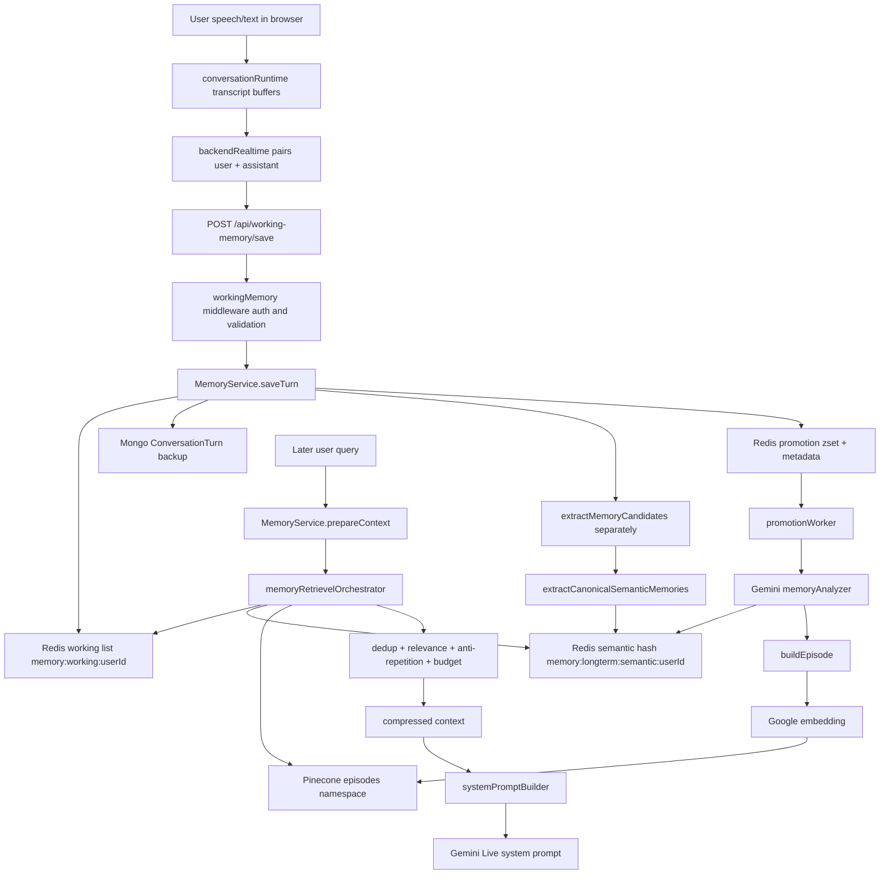
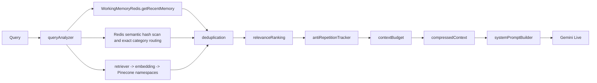
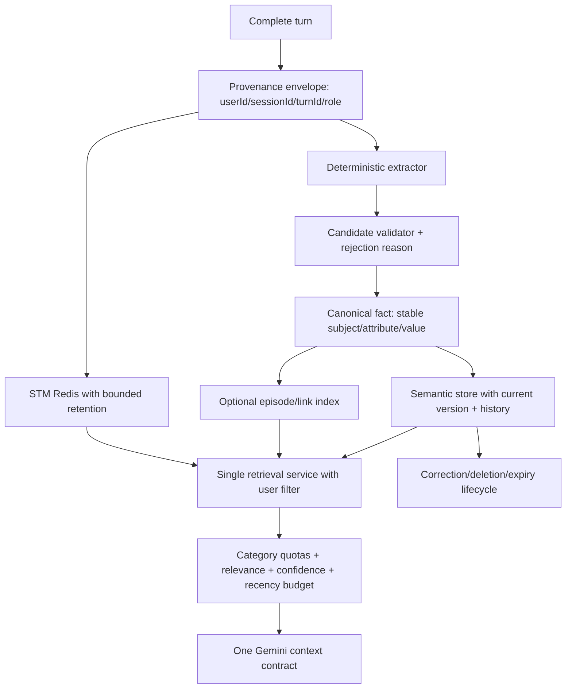

# Kiara Memory System — Complete Audit Report

**Audit date:** 2026-08-20  
**Repository:** `D:\Kiara`  
**Scope:** Current checked-out source under `kiara-server/` and `Kiara-ai/`, repository tests/scripts, and relevant history.  
**Source changes:** None. This audit created only this report.

## 1. Executive Summary

**VERIFIED FROM CODE:** The current checkout does not contain the large MongoDB LTM/service architecture described by several repository memory notes. The active memory path is:

1. Browser collects a complete user transcript and assistant transcript.
2. Frontend pairs them in `Kiara-ai/src/api/backendRealtime.ts` and posts `/api/working-memory/save`.
3. `kiara-server/src/services/memory/memory.service.js::saveTurn()` writes a complete turn to Redis working memory and attempts a MongoDB `ConversationTurn` backup.
4. The same function synchronously runs `extractMemoryCandidates()` and `extractCanonicalSemanticMemories()` separately for user and assistant text.
5. Canonical semantic records are written to one per-user Redis hash. Assistant identity records are rejected; assistant non-identity records are allowed.
6. A Redis promotion candidate is queued. The worker later asks Gemini to analyze recent turns, writes semantic records again, builds an episode, embeds it, and writes the episode to Pinecone.
7. Retrieval can read recent Redis turns, semantic Redis records, and Pinecone. It ranks and compresses them before the Live system prompt builder returns context to Gemini.

**VERIFIED BY LOCAL EXTRACTION PROBE:** The six requested examples are extracted and canonicalized, not rejected:

| Input | Candidate category | Confidence | Canonical group |
|---|---:|---:|---|
| `Mera naam Roshan hai.` | `identity` | `1.00` | `identity` |
| `Mujhe blue color pasand hai.` | `preference` | `0.85` | `preference` |
| `Mera favorite food pizza hai.` | `fact` | `0.85` | `fact` |
| `Mujhe coding karna pasand hai.` | `skill` | `0.85` | `skill` |
| `Main abhi AI/ML padh raha hoon.` | `fact` | `0.85` | `fact` |
| `Mera goal ek startup banana hai.` | `goal` | `1.00` | `goal` |

**Most likely explanation for “name works, other data does not”:** identity has the strongest explicit handling and the existing tests concentrate on it, while non-identity data is exposed through several weaker and inconsistent paths. The highest-confidence code causes are (1) retrieval/query intent mismatches, especially goals and skills; (2) category shape drift between singular Redis categories and plural assumptions in `_assembleContext`; (3) Live/bootstrap paths that often inject raw STM rather than semantic records; (4) promotion being optional, delayed, Pinecone-dependent, and not required for the direct semantic Redis write; and (5) identity correction creating a new value-keyed record instead of superseding the old value.

**Important qualification:** There is no verified end-to-end live Redis/Mongo/Pinecone run in this audit. The repository acceptance suite reports 14 passed, but those tests mostly test pure utilities and deliberately use missing-user/no-memory scenarios. The direct HTTP scripts require a running authenticated backend and were not treated as passing evidence.

## 2. Current Overall Status

| Area | Status | Evidence |
|---|---|---|
| Complete conversation STM save | ✅ Implemented | `MemoryService.saveTurn()` -> `saveConversationTurn()` |
| Redis STM retrieval | ✅ Implemented, short-lived | `memory:working:<userId>`, 20-minute selection, 24-hour key TTL |
| Direct semantic extraction | ✅ Implemented | Local probe retained all six examples |
| Direct semantic Redis write | ✅ Implemented in code | `upsertSemanticMemories()`; live storage not verified here |
| Identity source separation | ✅ Implemented | User and assistant extraction are separate |
| Assistant identity protection | ✅ Implemented, narrow to `identity` | `saveTurn()` filters assistant canonical identity |
| Non-identity promotion | ⚠️ Implemented but operationally conditional | Requires promotion worker and Gemini/Pinecone configuration |
| Episodic/vector memory | ⚠️ Implemented but not end-to-end verified | Pinecone episode promotion path exists |
| Mongo persistence | ⚠️ Raw-turn backup only | `ConversationTurn.create()`; no semantic read/recovery path |
| Query-aware semantic retrieval | ⚠️ Implemented with intent/category gaps | Orchestrator routes by exact category strings |
| Memory correction | ❌ No canonical correction lifecycle | Value is part of Redis hash field identity |
| Semantic deletion | ❌ Missing | Delete endpoint removes only working-memory list |
| Cross-user isolation | ✅ Strong at working-memory route boundary; ⚠️ not fully proven for every vector path | Auth binding plus per-user Redis keys; Pinecone filters are inconsistent |
| Gemini Live memory injection | ⚠️ Implemented, conditional and path-dependent | `systemPromptBuilder` calls `prepareContext()` only when triggered and gate allows |
| Production readiness | ❌ Not supported by current evidence | No broad category E2E, no proven recovery, no verified live persistence |

## 3. Complete Memory Architecture

### Active architecture



### Architecture that is described in stale repository notes but is not active in this checkout

The repository memory files mention `LongTermMemory`, `MemoryProfile`, `/api/memory`, bootstrap caches, promotion jobs, and many V6/V7 services. Those paths are not present in the current `kiara-server/src` tree. The current app imports `workingMemory.routes`, not the documented `memoryRoutes`. Those notes must not be used as runtime evidence for this checkout.

## 4. End-to-End Data Flow

### A. Actual save flow

```mermaid
sequenceDiagram
  participant UI as Kiara-ai Live runtime
  participant API as /api/working-memory/save
  participant MS as MemoryService.saveTurn
  participant R as Redis
  participant M as MongoDB
  participant W as Promotion worker
  participant G as Gemini text API
  participant P as Pinecone

  UI->>API: complete userMessage + aiResponse
  API->>MS: validate, user/session, live gate
  MS->>R: RPUSH serialized T/U/K turn; EXPIRE 24h
  MS->>M: ConversationTurn.create backup
  MS->>MS: extract user candidates/canonical facts
  MS->>R: HSET semantic hash; EXPIRE 7d
  MS->>MS: extract assistant candidates/canonical facts
  MS->>R: HSET non-identity assistant semantics; reject assistant identity
  MS->>R: HSET promotion metadata + ZADD promotion queue
  MS-->>API: success after direct semantic work
  W->>R: read due users and recent turns
  W->>G: analyze transcript as JSON memories
  W->>R: upsert analyzed semantic memories
  W->>G: compute embedding
  W->>P: upsert episode vector in episodes namespace
  W->>R: mark promoted episode and stats
```

**Important:** The comments in `memory.service.js` call extraction “background” and `_runBackgroundExtraction()` exists, but the actual `saveTurn()` path performs extraction and semantic upserts inline after the Redis/Mongo work. `_runBackgroundExtraction()` itself returns `undefined` and is not the active extractor.

### B. Actual retrieval flow



The orchestrator has an additional direct semantic branch that reads all semantic Redis hash values and maps them into retrieval records. It only asks Pinecone when no prior memories were found in the relevant path. Deep memory is a stub returning `[]`.

### C. Actual update/conflict flow

- Semantic Redis fields are keyed by `category + item.id`, where the canonical item ID contains the value. A new value normally creates a new hash field; it does not replace the old value.
- Identity protection checks only an exact field key. It rejects an assistant update when the existing exact record is user-sourced with confidence >= 0.9 and the assistant value has lower confidence. Because value is in the ID, a different assistant name can bypass the exact-field lookup, although the assistant identity group is filtered before upsert in `saveTurn()`.
- Promotion upsert similarly writes value-keyed fields. It does not perform category-aware supersession or versioning.
- Relationships are updated by person-name hash field and increment mention count/strength. There is no user-facing correction rule.
- Pinecone retrieval deduplicates by vector ID and prefers confidence/newer metadata; it does not reconcile semantic Redis records with Pinecone records.

## 5. Memory File Inventory

The following inventory covers the active memory path and indirect callers in the current checkout. Files mentioned in stale notes but absent from the tree are called out separately in the final appendix.

| File | Purpose | Layer | Reads | Writes | Called by | Storage | Important functions | Current status |
|---|---|---|---|---|---|---|---|---|
| [kiara-server/src/services/memory/memory.service.js](kiara-server/src/services/memory/memory.service.js) | Public orchestration facade; saves turns, invokes extraction, prepares context | Orchestration | Redis STM/semantic, env, gate | Redis STM/semantic/queue indirectly, Mongo through Redis op | Working-memory controller, Live system prompt builder | Redis, Mongo backup | `saveTurn`, `prepareContext`, `buildWorkingMemoryContext`, deletion wrappers | Critical; active; comments and implementation disagree about background extraction |
| [kiara-server/src/services/memory/extraction.js](kiara-server/src/services/memory/extraction.js) | Heuristic candidate classification, confidence, canonical semantic objects | Extraction/canonicalization | Text and source context | None | `saveTurn` | None | `extractMemoryCandidates`, `extractCanonicalSemanticMemories`, `classifyCandidate`, `scoreCandidate` | Critical; active; Hindi and English coverage is uneven |
| [kiara-server/src/services/workingMemory/redisOperations.js](kiara-server/src/services/workingMemory/redisOperations.js) | All active Redis memory operations | Storage | Redis lists, hashes, zsets, sets | STM list, semantic hash, relationship hash, queue, episode links, stats | Memory service, promotion, retriever, consolidation | Redis | `saveConversationTurn`, `getRecentMemory`, `upsertSemanticMemories`, `getSemanticMemories`, relationship/queue/stats methods | Critical; active; multiple TTLs and partial-failure paths |
| [kiara-server/src/services/memory/promotion/memoryAnalyzer.js](kiara-server/src/services/memory/promotion/memoryAnalyzer.js) | Gemini JSON extraction from transcript; fallback regex extraction | Promotion/extraction | Recent turns, Gemini | None directly | `memoryPromotionService` | None | `analyzeConversation`, `buildEpisode` | Active; category normalization and external model dependence |
| [kiara-server/src/services/memory/promotion/memoryPromotionService.js](kiara-server/src/services/memory/promotion/memoryPromotionService.js) | Converts recent turns to semantic records and an episode vector | Promotion | Redis turns/state, Gemini analysis | Redis semantic/stats/relationships/promoted set, Pinecone | Promotion worker, validation runner | Redis/Pinecone | `promoteUserMemory` | Active but delayed and Pinecone-gated; semantic write occurs before episode durability |
| [kiara-server/src/services/memory/promotion/promotionWorker.js](kiara-server/src/services/memory/promotion/promotionWorker.js) | Periodic due-user promotion | Worker | Redis queue | Redis queue/state and promotion side effects | `server.js` | Redis | `startPromotionWorker`, `_runPromotionCycle` | Active only when Pinecone and worker flags are enabled |
| [kiara-server/src/services/memory/retrieval/retriever.js](kiara-server/src/services/memory/retrieval/retriever.js) | Embedding and Pinecone namespace search/ranking | Vector retrieval | Query, embeddings, Pinecone, Redis stats/relationships | Redis access reinforcement stats | Orchestrator, validation, strict retriever | Pinecone/Redis | `queryNamespaces`, `retrieve`, scoring helpers | Active; namespace and query heuristics are brittle |
| [kiara-server/src/services/memory/retrieval/promptBuilder.js](kiara-server/src/services/memory/retrieval/promptBuilder.js) | Formats identity, relationships, goals, projects, preferences, facts, episodes, STM | Context composition | Structured retrieval data | None | `_assembleContext`, validation runner | None | `buildContext`, section builders | Active but not the main Live path in `prepareContext`; category data can be omitted before it arrives |
| [kiara-server/src/services/memory/retrieval/strictRetriever.js](kiara-server/src/services/memory/retrieval/strictRetriever.js) | Concise Pinecone result formatting | Retrieval | Retriever results | None | Potential callers/tests | None | `searchStrict` | Active utility; not central to current Live path |
| [kiara-server/src/services/memory/utils/memoryRetrievelOrchestrator.js](kiara-server/src/services/memory/utils/memoryRetrievelOrchestrator.js) | Query analysis, STM/semantic/LTM escalation, ranking, anti-repetition, budget | Retrieval | Redis, Pinecone retriever, query | In-memory anti-repetition and Redis stats indirectly | `prepareContext`, acceptance tests | Redis/Pinecone/in-process Map | `retrieveMemoryForQuery`, `retrieveMemoryWithEscalation` | Critical; filename typo is public internal API; deep search is stub |
| [kiara-server/src/services/memory/utils/queryAnalyzer.js](kiara-server/src/services/memory/utils/queryAnalyzer.js) | Intent/entity/keyword/temporal detection | Retrieval | Query/context | None | Orchestrator, acceptance tests | None | `analyzeQuery`, `detectIntent` | Active; no dedicated skill intent and project patterns precede goal patterns |
| [kiara-server/src/services/memory/utils/contextBudget.js](kiara-server/src/services/memory/utils/contextBudget.js) | Token/item caps and compression | Context budget | Structured records | None | Orchestrator, acceptance tests | None | `buildBudgetedContext`, `truncateContext` | Active; current `compressedContext` may bypass part of budget result |
| [kiara-server/src/services/memory/utils/relevanceRanking.js](kiara-server/src/services/memory/utils/relevanceRanking.js) | Weighted relevance scoring | Retrieval | Memory fields/query | None | Orchestrator, acceptance tests | None | `calculateRelevanceScore`, `rankMemories` | Active; defaults penalize records lacking metadata fields |
| [kiara-server/src/services/memory/utils/deduplicationService.js](kiara-server/src/services/memory/utils/deduplicationService.js) | Identity/fingerprint/text duplicate filtering | Retrieval | Candidate/existing records | None | Orchestrator, acceptance tests | None | `checkForDuplicates`, `deduplicateMemoryList` | Active; simple non-cryptographic fingerprint and flawed update condition |
| [kiara-server/src/services/memory/utils/memoryIdentity.js](kiara-server/src/services/memory/utils/memoryIdentity.js) | Stable IDs/fingerprints for utility tests | Identity/dedup utility | Memory object | None | Deduplication/tests | None | `generateMemoryIdentity`, `generateFingerprint` | Active utility; not the key generator used by semantic Redis upsert |
| [kiara-server/src/services/memory/utils/antiRepetitionTracker.js](kiara-server/src/services/memory/utils/antiRepetitionTracker.js) | In-process per-user/session surfaced set | Retrieval | Memory IDs | In-memory Map | Orchestrator/tests | Process memory | `initializeSession`, `filterOutSurfacedMemories` | Active; lost on restart and can hide a memory for the whole session |
| [kiara-server/src/services/memory/utils/memoryLogger.js](kiara-server/src/services/memory/utils/memoryLogger.js) | Named events, errors, performance hooks | Observability | Error/perf data | Console/perf collector | Almost all memory services | Logs/in-process counters | `log`, `logError`, stage methods | Active; several legacy methods intentionally no-op and error call signatures are inconsistent |
| [kiara-server/src/services/memory/utils/memoryTrace.js](kiara-server/src/services/memory/utils/memoryTrace.js) | Trace IDs and stage traces | Observability | Request context | Console/file-like trace abstraction | App and memory service | Logs | `createMemoryTraceId`, `log` | Active; trace IDs are not consistently propagated into every storage record |
| [kiara-server/src/services/memory/consolidation/consolidationService.js](kiara-server/src/services/memory/consolidation/consolidationService.js) | Merge semantic duplicates, relationship records, stats and episode links | Consolidation | Redis, Pinecone | Redis semantic/relationships/episode links/stats | Validation/manual callers | Redis/Pinecone | `consolidateUser`, `consolidateAll` | Active utility; not scheduled by `server.js`; some errors swallowed |
| [kiara-server/src/services/memory/validation/validationRunner.js](kiara-server/src/services/memory/validation/validationRunner.js) | Best-effort infrastructure validation | Testing/diagnostics | Redis, Pinecone, retriever, prompt builder | May seed STM and promotion state | Scripts/manual | Redis/Pinecone | `runValidation` | Active but some checks are contract-only and can pass with zero results |
| [kiara-server/src/services/memory/memoryStabilityGate.js](kiara-server/src/services/memory/memoryStabilityGate.js) | Per-session Live eligibility gate | Admission | Session health | In-memory Map | Live services and `saveTurn`/`prepareContext` | Process memory | `isMemoryEligible`, `markLiveSessionHealth` | Active; default allows absent state, explicit unhealthy state blocks |
| [kiara-server/src/services/memory/longTermHandoff.js](kiara-server/src/services/memory/longTermHandoff.js) | Placeholder handoff | Promotion | Snapshot | None | Snapshot timers | None | `prepareLongTermMemory` | Not implemented; snapshot is prepared then discarded |
| [kiara-server/src/services/infrastructure/redisService.js](kiara-server/src/services/infrastructure/redisService.js) | Redis client singleton and reconnect | Infrastructure | Env/Redis | Connection state | Redis operations | Redis | `initRedis`, `getRedisClient` | Active; throws initialization failures |
| [kiara-server/src/services/pineconeService.js](kiara-server/src/services/pineconeService.js) | Pinecone client, index, upsert/query/delete | Vector storage | Env/Pinecone | Pinecone vectors | Promotion/retriever/consolidation | Pinecone | `upsertLongTermVector`, `queryLongTermVectors`, `deleteLongTermVector` | Active; unavailable state makes later operations skip; dimension fallback switches process index |
| [kiara-server/src/models/ConversationTurn.js](kiara-server/src/models/ConversationTurn.js) | Raw conversation backup schema | Persistence | None | Mongo documents | Redis save | MongoDB | Mongoose model | Active; no memory extraction fields and no read/recovery path |
| [kiara-server/src/controllers/workingMemory/workingMemory.controller.js](kiara-server/src/controllers/workingMemory/workingMemory.controller.js) | HTTP adapter for save/read/context/stats/delete | API | Request/query | Via MemoryService | Routes | Redis/Mongo indirectly | Controller methods | Active; delete name overstates scope |
| [kiara-server/src/routes/workingMemory.routes.js](kiara-server/src/routes/workingMemory.routes.js) | `/api/working-memory` routes, auth binding and gate response | API boundary | Env/request/auth | None | App | None | route definitions | Active; requires auth except health and enforces user scope |
| [kiara-server/src/middleware/workingMemory/workingMemory.middleware.js](kiara-server/src/middleware/workingMemory/workingMemory.middleware.js) | Request validation and user binding | Admission/security | JWT request user/body/query | Normalizes IDs in request | Routes | None | `bindAuthenticatedUser`, `validateSaveRequest` | Active; generated session IDs can reduce continuity if client omits them |
| [kiara-server/src/middleware/authMiddleware.js](kiara-server/src/middleware/authMiddleware.js) | JWT validation and `req.userId` | Security | Authorization header/cookie token | Request state | Routes | None | `authMiddleware` | Active |
| [kiara-server/src/server.js](kiara-server/src/server.js) | Starts Mongo, server, promotion worker | Runtime | Env/DB | Worker timers | Process entry | Mongo/Redis/Pinecone indirectly | `startServer` | Active; worker requires Pinecone |
| [kiara-server/src/services/live/systemPromptBuilder.js](kiara-server/src/services/live/systemPromptBuilder.js) | Calls `MemoryService.prepareContext()` for Live token prompt | Gemini integration | User/session/gate | None | `geminiService` | None | `buildSystemPrompt` | Active only when trigger is supplied and gate permits |
| [kiara-server/src/services/live/geminiService.js](kiara-server/src/services/live/geminiService.js) | Gemini text/live calls, timeout/circuit breaker | Gemini integration | Prompt/context | External API/trace | Live routes/services | Gemini | request execution and token creation | Active; memory injection is optional and separately timed |
| [Kiara-ai/src/ai/conversationMemory.ts](Kiara-ai/src/ai/conversationMemory.ts) | Remote-first paired-turn persistence with IndexedDB fallback | Frontend persistence | Remote snapshot, local DB | Backend pair or local IndexedDB | Runtime/connection manager | Backend/IndexedDB | `saveConversationTurn`, `loadConversationSnapshot` | Active; user-only save is local fallback |
| [Kiara-ai/src/api/backendRealtime.ts](Kiara-ai/src/api/backendRealtime.ts) | Holds pending user turn and posts pair | Frontend API | Auth/user/session | `/api/working-memory/save` | `conversationMemory` | Backend | `persistRemoteMemoryTurn` | Active; assistant is required to complete pair |
| [Kiara-ai/src/ai/connectionManager.ts](Kiara-ai/src/ai/connectionManager.ts) | Flushes complete Live turn at turn completion | Frontend Live | Live transcripts | Calls conversation memory | Live runtime | Backend/local fallback | `saveTurnIfNeeded` | Active; incomplete transcripts are discarded/reset |
| [Kiara-ai/src/ai/conversationRuntime.ts](Kiara-ai/src/ai/conversationRuntime.ts) | Buffers/flushes transcript roles | Frontend Live | Live transcript | Remote/local memory | Connection manager | Backend/local | `flushPendingUserMemory`, `flushAssistantMemory` | Active; user and assistant flushes are separate |
| [Kiara-ai/src/services/bootstrapEngine.ts](Kiara-ai/src/services/bootstrapEngine.ts) | Fetches working context and builds seed prompt | Frontend context | `/working-memory/context` | Gemini session message through caller | Session setup | Backend | `fetchBootstrap`, `buildSeedPrompt` | Active but backend endpoint returns raw STM context, not semantic summaries |
| [kiara-server/test-e2e-complete.js](kiara-server/test-e2e-complete.js) | HTTP identity/working-memory scenario | Test | HTTP backend | Test data | Manual | Redis/Mongo via server | STORE/RECALL tests | Not verified in this audit |
| [kiara-server/test-memory-direct.js](kiara-server/test-memory-direct.js) | Direct unauthenticated Roshan test | Test | HTTP backend | Test data | Manual | Redis/Mongo via server | identity save/context | Not verified; request lacks auth |
| [kiara-server/test-verification.js](kiara-server/test-verification.js) | Semantic-vs-working identity contamination scenario | Test | HTTP backend | Test data | Manual | Redis/Mongo via server | Roshan/Abhi scenario | Not verified in this audit |
| [kiara-server/src/services/memory/utils/memoryAcceptanceTests.js](kiara-server/src/services/memory/utils/memoryAcceptanceTests.js) | Utility acceptance suite | Test | Pure modules and attempted retrieval | In-process state; may call external embedding | None intended | In-process/external if configured | 14 tests | Verified run: 14 passed, but not category persistence E2E |
| [kiara-server/scripts/run-memory-validation.js](kiara-server/scripts/run-memory-validation.js) | Runs validation runner | Diagnostic | Infrastructure | Optional seed | Manual | Redis/Pinecone | validation orchestration | Not run |
| [kiara-server/scripts/run-memory-certification.js](kiara-server/scripts/run-memory-certification.js) | Certification flow | Diagnostic/test | HTTP/backend | Test data | Manual | Backend stores | certification checks | Not run |
| [kiara-server/scripts/validate-memory-infra.js](kiara-server/scripts/validate-memory-infra.js) | Infrastructure checks | Diagnostic/test | Redis/Pinecone/Gemini | None | Manual | External stores | infrastructure validation | Not run |
| [kiara-server/scripts/test_memory.js](kiara-server/scripts/test_memory.js) | Package-script memory test target | Test | Backend | Test data | `npm run test:memory` | Backend stores | script-defined checks | Present but command was not run |
| [kiara-server/src/config/env.js](kiara-server/src/config/env.js) | Feature flags, TTLs, Pinecone/Gemini config | Configuration | Environment | None | All services | None | `liveMemoryEnabled`, `enablePinecone`, `enablePromotionWorker`, TTL settings | Critical configuration dependency |

## 6. Function-Level Memory Map

| Function | Inputs | Output | Calls/storage | Failure behavior | Main issue |
|---|---|---|---|---|---|
| `MemoryService.saveTurn` | `userId`, `sessionId`, user text, assistant text, TTL | Save result and trace ID | Validates; Redis turn; Mongo backup; direct extraction; semantic HSET; queue | Throws on core Redis failure; catches candidate pipeline and returns success | A successful response can mean STM saved while semantic/promotion behavior is only logged or absent |
| `WorkingMemoryRedis.saveConversationTurn` | User/session/messages/TTL | `{success,totalTurns,turnId}` | RPUSH `T/U/K`; expire; Mongo `ConversationTurn.create`; queue | Mongo and queue errors are swallowed/logged; Redis failure throws | One operation mixes primary write, backup, and queue side effects |
| `extractMemoryCandidates` | Raw text, `sourceRole`, trace context | Candidate list with category/evidence/confidence | Heuristic segmentation and filtering | Empty list for rejected/empty text | Category detection is language/pattern limited |
| `extractCanonicalSemanticMemories` | Raw text/context | Grouped canonical objects | Calls candidate extraction; value normalization | Drops unsupported category | Canonical value is mostly whole sentence, not attribute/value parsing |
| `upsertSemanticMemories` | User ID, grouped items, source/turn | Count | HSET `memory:longterm:semantic:<userId>`; expire 7d | Returns `0` after logging on Redis error | Does not transactionally report failure to `saveTurn`; value-keyed IDs prevent correction |
| `getSemanticMemories` | User ID | `{category: items[]}` | HGETALL semantic hash, JSON parse | Returns `{}` on error/malformed item | Malformed entries disappear silently |
| `promoteUserMemory` | User ID | Promotion metrics | Reads STM; Gemini `analyzeConversation`; semantic upsert; embed; Pinecone; relationships | Throws on Gemini/embedding/Pinecone; worker retries user | Semantic data can be saved while episode fails; worker is optional |
| `analyzeConversation` | Recent turns/user ID | Facts, grouped semantics, topics/entities/decisions | Gemini JSON or fallback regex | Returns empty on no key/errors; fallback only on invalid JSON | “No API key” means no semantic promotion, even though direct save extraction exists |
| `retrieveMemoryForQuery` | Query/session context | Ranked selected memories/context packet | STM; Redis semantic exact category; Pinecone if no memories; deep stub; dedup/rank/anti-repeat | Search errors return empty; timeouts return empty | Exact intent-to-category routing can make stored facts invisible |
| `retrieveMemoryWithEscalation` | User/session/query/options | Context, count, budget | Query analysis, retrieve, budget | Caller receives empty context on exceptions | Direct compressed context may not reflect budgeted sections |
| `retriever.retrieve` | User/query/topK | Ranked Pinecone matches | Embedding; namespace queries; stats reinforcement | Pinecone/query errors logged and skipped | Identity/facts/projects namespaces depend on vector promotion, not semantic Redis |
| `promptBuilder.buildContext` | Identity/relationships/goals/projects/preferences/facts/episodes/turns | Formatted string | Builds ordered sections | Omits empty/duplicate records | `_assembleContext` supplies plural lookup keys while semantic Redis stores singular keys |
| `systemPromptBuilder.buildSystemPrompt` | User/session/trigger/query | `{systemPrompt}` | Gate + `MemoryService.prepareContext` + guidelines | Returns empty prompt on failure/no trigger | Live receives memory only at explicit prompt-build triggers |
| `deleteUserMemory` | User ID | Deleted boolean | Deletes only `memory:working:<userId>` | Throws on Redis error | Leaves semantic, relationships, queue, stats, Pinecone, and Mongo data |

## 7. Memory Data Schema

### Working turn

| Field | Type | Required | Created/updated/read/stored | Potential issue |
|---|---|---:|---|---|
| `turnId` | string | Stored parser requires it for object/array forms, but current T/U/K serialization omits it | Generated in `saveConversationTurn`; returned to caller; not encoded in T/U/K | Current `getRecentMemory()` returns no `turnId` because T/U/K parser does not reconstruct it |
| `timestamp` | ISO string / Date | Yes | Created on Redis save; read for sliding-window filtering; Mongo Date | Good for STM, not durable semantic provenance |
| `sessionId` | string | API required | Passed to Redis metadata and Mongo; not stored in current T/U/K payload | Redis working key is user-only, so all sessions share the list |
| `userMessage` | string | Yes | Normalized for Redis; raw for Mongo; read by context/extraction | Complete turn required from frontend |
| `assistantMessage`/`assistantResponse`/`aiResponse` | string | Yes | Normalized/serialized; aliases reconstructed by legacy parser | Naming drift across frontend/backend |
| `raw` | mixed | Mongo default | Created in `ConversationTurn.create` | Backup only; never used for recovery |

### Semantic record

| Field | Type | Required | Created where | Read/stored | Potential issue |
|---|---|---:|---|---|---|
| `id` | string | Effectively required for stable Redis field | Canonical extraction or analyzer | Redis JSON; orchestrator; Pinecone metadata may use `memoryId` | Contains value, so correction creates a new record |
| `category` | string | Yes | Extractor/analyzer | Redis grouping, query routing, context formatting | Singular/plural normalization is inconsistent |
| `key` | string | Yes for upsert | Extractor/analyzer | Prompt labels and hash field | Often generic (`preference`, `goal`, `fact`) |
| `label` | string | No | Extractor/analyzer | Prompt builder | Not consistently meaningful |
| `value` | string | Yes | Extractor whole sentence or identity name | Redis, orchestrator context | Preference values are not parsed into attribute/value pairs |
| `source` | `user`/`assistant`/unknown | No | `saveTurn` context or analyzer output | Identity protection, logs | Promotion analyzer does not reliably preserve user/assistant provenance per fact |
| `confidenceScore` / `confidence` | number | No | Heuristic or Gemini | Retrieval/ranking/stats | Two names; no shared schema |
| `importance` | number | No | Heuristic/Gemini/promotion | Ranking/stats | Direct semantic records are not initialized in memory stats |
| `source_turn_ids` / `turnId` | array/string | No | Canonical context or upsert option | Redis JSON; analyzer facts | Current direct save gets `turnId` option but some local probes had no source turn |
| `createdAt`, `updatedAt` | ISO | No | Extraction/upsert | Ranking/Pinecone | Redis upsert always replaces `updatedAt`, but does not version |
| `reason` | string | No | Extractor/analyzer | Logs/diagnostics | Often generic; no rejection record attached to a saved candidate |

### Episode record and vector metadata

`memoryPromotionService.buildEpisodeMetadata()` creates `userId`, `memoryId`, `memoryType: episode`, `createdAt`, `updatedAt`, `importance`, `entities`, `topics`, `emotion`, `summary`, timeline markers, embedding/promotion versions, and source. The vector ID is `episode:<sanitizedUserId>:<start>:<end>`, namespace `episodes`. Pinecone stores metadata and vector values; no TTL or Mongo mirror exists.

## 8. Working Memory

Working memory is a Redis list at `memory:working:<userId>`. The list stores compact text records:

```text
T:<timestamp>
U:<normalized user text>
K:<normalized assistant text>
```

`saveConversationTurn()` also sets a 24-hour inactive TTL and then removes records older than 20 minutes in `cleanupExpiredTurns()`. Therefore the effective read lifetime is approximately 20 minutes, while stale records may remain in Redis until cleanup or key expiry. The key is user-scoped but not session-scoped; `sessionId` is not in the current T/U/K payload.

**What works:** same-process recent-turn retrieval when Redis is available and the turn is complete.  
**What does not work:** a durable cross-session working-memory guarantee; Redis restart loses it unless semantic/Pinecone promotion already succeeded. Mongo contains a backup but no recovery reader.

## 9. Semantic Memory

Semantic records are stored in a Redis hash at `memory:longterm:semantic:<userId>`. Each hash field is `${category}:${safeFieldId}`, where `safeFieldId` is the item ID or `key:value` fallback. The JSON value includes the semantic object, source, turn ID, and updated timestamp. The entire hash receives a seven-day TTL.

Direct save path: user extraction is authoritative for all supported canonical categories; assistant extraction is allowed except `identity`. Promotion path: Gemini analysis maps plural model categories to singular buckets and upserts them, with no equivalent source separation guarantee.

The active retrieval path reads the semantic hash and routes exact categories for identity, preference, relationship, project, goal, and skill intents. It can retrieve `fact` records through keyword/value fallback, but a query must produce matching keywords or the correct intent. There is no Mongo semantic model in the active tree.

## 10. Episodic / Vector Memory

Episodes are constructed by `buildEpisode()` from a promotion window of recent turns. The episode contains compressed timeline entries, topics, entities, decisions, emotion, outcome, and embedding text. `promoteUserMemory()` computes an embedding using `computeEmbedding()` and writes the vector to Pinecone namespace `episodes`.

**Status:** implemented but not end-to-end verified. Embedding model is configured in [kiara-server/src/utils/memory/memoryUtils.js](kiara-server/src/utils/memory/memoryUtils.js) and the promotion path records embedding metadata. `searchDeepMemory()` is explicitly a stub returning an empty array. Historical episode retrieval therefore depends on the Pinecone retriever and query intent, not a deep archive fallback.

Identity and semantic facts are not automatically written as vectors by the direct `saveTurn()` path. Pinecone receives episodes; the semantic Redis hash receives facts. The two stores are not a single source of truth.

## 11. Memory Extraction

There are two extraction implementations:

1. `extraction.js`: synchronous heuristic extraction used directly on every saved turn.
2. `promotion/memoryAnalyzer.js`: Gemini JSON extraction over a batch of turns, with regex fallback only when Gemini returns invalid JSON.

`extraction.js` segments text, rejects discourse/fragments/technical noise/temporary text, classifies in this order: project, goal, skill, preference, identity, relationship, fact. The ordering is significant. For example, `coding` is classified as `skill` before `preference`, and project signals are checked before goal signals.

**Verified local behavior:** requested examples survive. **Not verified:** actual Redis writes from those examples under a live authenticated server.

## 12. Classification

Actual supported direct categories are `identity`, `relationship`, `preference`, `goal`, `project`, `skill`, and `fact`. The promotion analyzer accepts a wider plural set including `locations`, `organizations`, `important_events`, `important_episodes`, `temporary_tasks`, and `conversation_summary`, but unknown/unsupported categories are rejected or normalized to `fact` only in some paths.

Classification is heuristic, not schema-driven. `Mera favorite food pizza hai.` becomes `fact`, not `preference`, because the direct preference regex does not include `favorite`. `Main abhi AI/ML padh raha hoon.` becomes `fact` because `padh raha hoon` is not a skill signal. These records are still canonicalized, but their retrieval route is less specific.

## 13. Garbage Filtering

The direct extractor rejects empty strings, fragments, discourse, technical noise, temporary/error text, and candidates below confidence `0.4`. It logs a rejection reason, but `rejectedReasons` is emitted as a generic array even when no candidates were rejected.

The promotion analyzer has its own validation: required category/content/source IDs, allowed-category set, and supported turn IDs. A Gemini response with missing/invalid source IDs can lose a fact even when its content is correct. A missing Gemini key returns zero promoted facts without trying the direct extractor; direct save extraction remains independent.

## 14. Canonicalization

`extractCanonicalSemanticMemories()` converts a candidate into an object. Identity values receive special name parsing and user identity confidence `0.95`; other categories retain the entire sentence as `value`. This is why preference/fact/skill records are technically saved but not normalized into fields such as `favoriteColor: blue` or `food: pizza`.

Canonical categories are singular. Promotion analyzer accepts plural categories and normalizes them. `_assembleContext()` in `memory.service.js` reads `semantic.preferences`, `semantic.goals`, and `semantic.projects`, while direct storage uses `preference`, `goal`, and `project`. That is a verified shape mismatch in a context assembly path.

## 15. Confidence System

| Evidence | Direct heuristic result | Storage effect |
|---|---:|---|
| User identity statement with `naam/name` | Up to `1.0` preliminary; canonical `0.95` | Strong identity record and assistant protection |
| Explicit user preference | Usually `0.85` in probe | Stored if Redis succeeds |
| User goal with goal/project signals | `1.0` for tested goal | Stored as `goal` |
| User skill/coding statement | `0.85` for tested coding example | Stored as `skill` |
| AI-generated identity | Candidate can be extracted, but canonical assistant identity is filtered | Not written by direct save path |
| “Maybe”/uncertain statement | No dedicated uncertainty penalty | May be stored if other evidence reaches threshold |
| Repeated statement | Adds `0.1` | No formal versioning |
| AI repeats a user fact | Source is assistant; non-identity may be written | Provenance is not consistently preserved through promotion |

Confidence affects direct identity protection, retrieval ranking fields, and promotion stats. It does not provide a uniform minimum threshold at the Redis semantic upsert boundary: any grouped item with key/value is written.

## 16. Source Attribution

The direct save path explicitly calls extraction with `sourceRole: 'user'` and `'assistant'`. Canonical records receive `source`, and the Redis upsert receives a fallback source and turn ID. Assistant identity records are rejected before writing. This is the recent safety improvement.

The promotion analyzer sees a transcript containing `USER:` and `ASSISTANT:` but its accepted memory objects do not enforce a source-role field. A Gemini extraction could therefore create a fact based on assistant text unless the model follows the prompt perfectly. The code validates category/content/source turn IDs, not speaker provenance.

Supported trust model in current code:

| Source | Can create direct semantic memory | Can create identity | Can update/overwrite | Can delete |
|---|---:|---:|---:|---:|
| User | Yes | Yes, high confidence | Creates another value-keyed record | No semantic delete API |
| Assistant | Yes for non-identity | Direct path rejects identity | Can create non-identity records | No |
| Gemini analyzer | Yes during promotion | Allowed by analyzer; no source field enforcement | Can add records | No |
| System/external | No explicit source contract | No explicit API | No explicit API | Working list delete only |
| Unknown | Upsert fallback permits it if caller supplies data | Potentially | Potentially | No |

## 17. Conflict Resolution

There is no complete category-specific conflict resolver in the active implementation.

- Identity: direct assistant identity filtering plus exact-field confidence guard. Different values are separate hash fields.
- Preferences/goals/facts/skills: new values coexist; no superseded flag, current value, validity interval, or correction command.
- Relationships: same exact person-name hash is merged and mention counts increase; spelling/casing variants can become separate fields until consolidation.
- Episodes: duplicate episode IDs are skipped only when the exact generated ID is already in the promoted set.

## 18. Memory Promotion

Promotion is queued from every successful Redis turn save. The queue is a global sorted set `memory:promotion:queue` with per-user metadata. The worker runs only when `env.enablePinecone` and `env.enablePromotionWorker` are true. Promotion is throttled to once per 15 minutes per user.

The promotion order is: read new STM turns -> Gemini analyze -> semantic Redis upsert -> Pinecone index ensure -> episode embedding -> Pinecone upsert -> stats/relationships -> mark promoted. This ordering creates partial persistence: semantic facts may exist even when embedding or Pinecone fails. Conversely, with no worker or no Gemini key, direct semantic extraction is the only semantic path.

## 19. Redis Storage

| Key | Type | Purpose | Written by | Read by | TTL |
|---|---|---|---|---|---:|
| `memory:working:<userId>` | List | Serialized recent complete turns | `saveConversationTurn` | `getRecentMemory`, context/orchestrator, promotion | 24h key TTL; reads select 20m |
| `memory:longterm:semantic:<userId>` | Hash | JSON semantic records by category/ID | `upsertSemanticMemories` | `getSemanticMemories`, orchestrator, consolidation | 7 days |
| `memory:relationships:user:<userId>` | Hash | JSON person relationship records | `upsertRelationship` | retriever, prompt builder, consolidation | 7 days |
| `memory:promotion:queue` | Sorted set | Due user IDs | enqueue/defer/worker | worker | 7 days |
| `memory:promotion:user:<userId>` | Hash | queue state, retries, last promotion | queue methods | worker/promotion | 7 days |
| `memory:promotion:promoted:<userId>` | Set | promoted episode IDs | `markEpisodePromoted` | promotion/consolidation | 7 days |
| `memory:episode:links:<episodeId>` | Hash | previous/next/related episode links | promotion/consolidation | consolidation | 7 days |
| `memory:stats:<memoryId>` | Hash | importance/confidence/access/retrieval priority | promotion/retriever | retriever/consolidation/decay | No TTL set here |

### Redis risks

- Redis semantic and relationship records expire after seven days, despite being called long-term.
- Mongo does not restore expired Redis semantic data.
- Semantic field IDs include values, so corrections do not overwrite.
- `getSemanticMemories()` silently ignores malformed JSON.
- `deleteExpiredMemory()` only deletes the working list.
- Global promotion queue is intentionally shared but stores user IDs; its isolation depends on correct per-user metadata and member values.
- STM `sessionId` is not part of the primary key.

## 20. Database Persistence

MongoDB is a raw conversation backup, not the active semantic source of truth. `ConversationTurn` stores `userId`, `sessionId`, user/assistant text, timestamp, and raw mixed data. It is written after Redis success. Mongo failures are logged but do not fail the request.

There is no current read path from Mongo to rebuild Redis STM or semantic memory. Therefore:

```text
Turn -> Redis STM + Mongo raw backup
Redis semantic -> no Mongo copy
Redis/Pinecone restart -> no verified automatic recovery
```

A successful Mongo write does not prove semantic persistence. A successful API response can coexist with Mongo failure and queue failure.

## 21. Vector Storage

Pinecone uses the configured index and namespaces such as `episodes`, `identity`, `facts`, `semantic`, `projects`, and `relationships` in retrieval code. In the active promotion writer, only `episodes` are explicitly upserted. Direct semantic Redis facts are not vectorized.

`queryLongTermVectors()` returns `[]` when Pinecone is unavailable and marks the process unavailable after failure. `upsertLongTermVector()` attempts verification and, on dimension mismatch, can create/switch to a validation index for the process. That fallback is operationally risky because subsequent retrieval may query the configured index while writes went to the temporary index.

Vector metadata includes user ID for episodes, but retriever namespace filters do not consistently add `{userId: ...}`. The namespace is not a substitute for user isolation.

## 22. Retrieval Pipeline

The orchestrator always tries STM for an eligible query. It then scans semantic Redis records and filters by intent:

- `identity_recall` -> `identity`
- `preference_query` -> `preference`
- `relationship_query` -> `relationship`
- `project_query` -> `project`
- `goal_query` -> `goal`
- `skill_query` -> `skill`
- otherwise keyword/value/key/category match

The query analyzer currently has identity, preference, relationship, project, recall, temporal, and generic intents. It has no explicit skill intent. Project patterns are checked before goal patterns, so queries containing `project`, `build`, `work`, `app`, or `goal` can be routed as `project_query`. An item stored correctly can therefore miss the exact category branch.

Selected memories are deduplicated, ranked, anti-repetition filtered, limited to five, and formatted. Deep search always returns empty.

## 23. Context Composition

There are two active-looking composition paths:

1. `MemoryService.prepareContext()` uses the intelligent orchestrator and returns `result.context`, which is primarily the selected-memory compressed text.
2. `_assembleContext()` uses `promptBuilder.buildContext()` with explicit identity/relationship/goal/project/preference/facts/episodes sections, but this path is not what `prepareContext()` calls.

The direct `/api/working-memory/context` compatibility endpoint uses `buildWorkingMemoryContext()` and returns raw formatted recent turns only. The frontend `bootstrapEngine` calls this endpoint and truncates it to 500 characters. It does not receive the semantic Redis hash directly.

`promptBuilder` has explicit sections for identity, relationships, goal, active project, preferences, long-term facts, relevant episodes, and recent STM. The current Live route may bypass most of those explicit sections in favor of orchestrator `compressedContext`.

## 24. Gemini / Gemini Live Integration

At Live token/system-prompt creation, `systemPromptBuilder.buildSystemPrompt()` calls `MemoryService.prepareContext()` only when a trigger is passed, user/session IDs exist, and the memory stability gate allows it. It appends response guidelines and returns the result to the Gemini service.

After a Live turn completes, the frontend calls `saveConversationTurn()` for user and assistant transcript roles. The backend pair is posted only when the assistant call sees a pending user turn. On cleanup, `persistConversationMemory()` flushes user and assistant buffers concurrently with `Promise.allSettled`; a user-only flush cannot complete a backend pair and falls back locally.

Memory retrieval is not continuously injected after every speech turn by the backend. It is primarily built at explicit Live context/token triggers and through frontend bootstrap. Reconnects preserve a Gemini resumption handle and frontend runtime state, but semantic context is not proven to survive unless a new prompt build retrieves it.

## 25. Session Persistence

| Event | Working STM | Semantic Redis | Mongo raw turns | Pinecone episodes | Evidence |
|---|---|---|---|---|---|
| Same turn | Yes after paired save | Yes direct path if Redis succeeds | Attempted | No, delayed | Code |
| Same session | Yes for recent <20m turns | Yes until 7d TTL | Yes if write succeeded | Eventually if worker succeeds | Code |
| New session | Same user key can still expose recent turns | Same user hash | Not used | Retriever can search if vector exists | Code |
| Page reload | Frontend remote snapshot uses STM context | Not directly | Not used | Not directly | Frontend code |
| Browser restart | Backend only if pair was saved; local fallback may remain IndexedDB | Backend if saved | Backend if saved | Backend if promoted | Inferred from code |
| Backend restart | Redis/Mongo/Pinecone external data can remain | Redis hash remains until TTL | Mongo remains | Pinecone remains | No recovery path verified |
| Redis restart | STM/semantic/relationships/queue/stats may be lost | Same | Mongo raw only | Pinecone episodes remain | No restore reader |
| Mongo restart | Redis can continue if independent | Redis can continue | Backup unavailable | Independent | Connection behavior |

## 26. Cross-User Isolation

Working-memory routes authenticate with JWT, compare every supplied body/query/path user ID to `req.userId`, and overwrite request user ID with the authenticated value. Redis working, semantic, relationship, and promotion metadata keys include user ID.

Risks remain in vector retrieval: `retriever.queryNamespaces()` sends namespace and relationship filters but does not consistently send a `userId` metadata filter. Episode metadata includes user ID, but that is not sufficient unless the query filter uses it. Pinecone namespace isolation is category-based, not user-based. This is **HIGH severity until verified with a two-user vector test**.

The in-process anti-repetition Map uses `userId:sessionId`, which is isolated within a process. Generated/fallback anonymous IDs in the orchestrator are a risk if callers omit identity, although Live `prepareContext` rejects missing user ID.

## 27. Error Handling

Redis initialization errors throw. STM save errors fail the request. Mongo backup errors are logged and ignored. Queue enqueue errors are logged and ignored. Direct candidate/canonical pipeline errors are caught and logged while the overall save result remains successful. Pinecone query errors return empty results. Pinecone promotion errors cause worker failure and retry.

Many legacy logger calls pass `(message, stack, userId, sessionId)` to a logger whose signature is `(tag, err, context)`. This can lose structured user/session context. Several `catch {}` blocks in consolidation, prompt/live utilities, and frontend intentionally suppress errors. A developer cannot always determine from logs whether a specific non-identity candidate was rejected, upserted, or later omitted.

## 28. Async / Race Conditions

- `saveTurn()` awaits direct semantic extraction/upsert, but frontend role saves are split and cleanup uses concurrent `Promise.allSettled`.
- Promotion runs asynchronously after the API response and can overlap with new STM saves.
- `incrementMemoryAccess()` reads a Redis hash, calculates new values, then writes in a pipeline without a transaction or `HINCRBYFLOAT`; concurrent retrievals can lose increments.
- Promotion state and queue zset are updated in separate operations in some methods.
- Pinecone upsert verification adds latency and can race with process-level index switching after dimension mismatch.
- The orchestrator uses `Promise.race` timeouts without cancelling underlying Redis/embedding/Pinecone requests. Work can continue after the caller has received an empty result.
- Snapshot timers call a placeholder handoff and do not promote the snapshot themselves.

## 29. Logging & Observability

Named events include `STM_SAVE`, `STM_SAVE_SUCCESS`, `MEMORY_CANDIDATE_EXTRACTED_FROM_USER`, `MEMORY_CANONICAL_SEMANTIC_SAVED_FROM_USER`, `MEMORY_ASSISTANT_IDENTITY_REJECTED`, `MEMORY_ANALYZER`, `MEMORY_RETRIEVAL_START`, `MEMORY_SELECTED`, `MEMORY_EXCLUDED`, `CONTEXT_BUILD`, Pinecone verification/upsert events, promotion metrics, and memory trace stages.

The logs can answer some questions: whether Redis STM saved, how many direct candidates survived, which categories were upserted, and whether assistant identity was filtered. They cannot reliably answer all of: which exact candidate was rejected by each stage, whether the semantic HSET was later expired, whether a query failed because of category routing, or whether Pinecone returned a cross-user result. Several legacy logger methods are no-ops (`factExtracted`, `factUpdated`, `contextBuilt`, etc.).

## 30. Existing Tests

| Test/script | What it actually tests | Result/evidence |
|---|---|---|
| `src/services/memory/utils/memoryAcceptanceTests.js` | Query analysis, dedup, identity ID, ranking, budget, anti-repeat, missing-memory contract | **VERIFIED:** 14 passed locally. It is not a persistence test. |
| `test-e2e-complete.js` | HTTP identity STM save/recall/new-session/page-reload and unrelated turns | **NOT VERIFIED:** requires running server/auth/environment; its “new session” still reads user-global STM. |
| `test-memory-direct.js` | HTTP Roshan identity and AI contamination scenario | **NOT VERIFIED:** request does not attach the auth token required by current routes. |
| `test-verification.js` | Authenticated Roshan vs Abhi semantic/working-memory interpretation | **NOT VERIFIED:** requires live backend and Redis. |
| `scripts/run-memory-validation.js` + `validationRunner.js` | STM, promotion, embedding, Pinecone, relationship, ranking, retrieval, context, consolidation | **NOT RUN.** Several checks allow empty result arrays and are health checks, not behavior assertions. |
| `scripts/run-memory-certification.js` | Certification workflow | **NOT RUN.** |
| `scripts/validate-memory-infra.js` | External infrastructure validation | **NOT RUN.** |
| Frontend TypeScript tests | No memory-specific test evidence found in active tree | **NOT VERIFIED.** |

## 31. Complete Memory Test Matrix

Legend: **PASS** means an actual local test/probe passed; **FAIL** means a reproducible failure; **NOT TESTED** means no valid end-to-end evidence.

| Memory type/scenario | Extract/classify | Store | Retrieve | New session | Update/conflict | Result |
|---|---|---|---|---|---|---|
| Identity/name save | PASS, local probe | NOT TESTED live | Utility/HTTP scripts only | NOT TESTED live | Parallel values likely | Implemented, identity utility-tested |
| Identity AI contamination | Direct code filter | NOT TESTED live | Script exists | NOT TESTED | Direct assistant identity blocked | Implemented, not live-verified |
| Identity correction | Candidate survives | New value-keyed record | May return both | Not tested | No supersession | FAIL by design for canonical correction |
| Preference | PASS, local probe | NOT TESTED live | Query route exists | NOT TESTED | No update rule | Implemented, untested |
| Favorite food | PASS as `fact`, not preference | NOT TESTED live | Generic keyword route | NOT TESTED | No update rule | Implemented but misclassified |
| Interest/skill | PASS for coding as `skill` | NOT TESTED live | No dedicated analyzer intent | NOT TESTED | No update rule | Implemented but retrieval weak |
| Goal | PASS, local probe | NOT TESTED live | Exact `goal` branch exists but analyzer lacks reliable goal intent | NOT TESTED | No update rule | Implemented but retrieval untested |
| Project | Not directly probed | NOT TESTED live | Pinecone/project and semantic project routes | NOT TESTED | No update rule | Implemented but untested |
| Relationship | Regex/analyzer support | NOT TESTED live | Redis relationship and Pinecone traversal | NOT TESTED | Merge by exact person key | Implemented but untested |
| Habit/routine | No dedicated direct category | Not verified | No dedicated route | Not tested | None | Not clearly implemented |
| General fact | PASS for examples as `fact` | NOT TESTED live | Generic value matching | NOT TESTED | No lifecycle | Implemented but untested |
| Episodic conversation | Analyzer/buildEpisode code | NOT TESTED live | Pinecone episodes path | NOT TESTED | Duplicate ID only | Implemented but untested |
| Deletion | Working list only | PASS only for STM API semantics | Semantic/vector remain | Not applicable | No forget API | FAIL for complete deletion |
| Negative empty/malformed | Utility filtering/parser code | Not comprehensively tested | Malformed semantic entries ignored | Not tested | Not tested | Partial |

## 32. What Currently Works

- ✅ Complete paired user/assistant turns can be stored in Redis STM when authentication, Live gate, Redis, and validation all succeed.
- ✅ Direct extraction separates user and assistant source roles.
- ✅ User identity receives elevated confidence and assistant identity is rejected in the direct save pipeline.
- ✅ Requested non-identity examples survive direct extraction and canonicalization in the local probe.
- ✅ Semantic Redis records have per-user keys and explicit source/turn fields in the direct path.
- ✅ Utility retrieval components have verified unit-style coverage: query analysis, deduplication, ranking, budget, anti-repetition, and controlled empty-memory behavior.
- ✅ Promotion, embedding, Pinecone episode storage, relationship updates, and stats have an implemented path.

## 33. What Currently Does Not Work

- ❌ Complete memory deletion: API removes only STM Redis list.
- ❌ Canonical correction/versioning: changed values coexist; old identity can remain retrievable.
- ❌ Durable semantic recovery: Mongo stores only raw turns and is never read for rebuild.
- ❌ Deep historical search: explicitly returns `[]`.
- ⚠️ Reliable non-identity retrieval: exact intent/category routing and plural/singular drift can omit valid records.
- ⚠️ Production-grade episodic durability: semantic write can succeed while embedding/Pinecone fails; worker is optional and delayed.
- ⚠️ Proven vector isolation: no consistent user metadata filter in retriever namespace queries.
- ⚠️ Live memory guarantee: frontend pairs only complete transcripts; user-only cleanup is local fallback; prompt injection requires a trigger/gate.

## 34. Current Known Problem — Non-Identity Data Not Saving

### Evidence chain

1. **Extraction:** local probe shows all six examples produce surviving candidates.
2. **Canonicalization:** local probe shows all six produce grouped semantic objects.
3. **Direct upsert:** code accepts every supported canonical group and writes it to the per-user semantic hash if Redis succeeds.
4. **Storage visibility:** the active `/api/working-memory/context` endpoint does not read semantic Redis; it returns recent STM text. A test that inspects that endpoint is testing conversation memory, not canonical semantic memory.
5. **Live retrieval:** `prepareContext()` uses query-aware routing. Goals, skills, generic facts, and plural category assumptions are weak points.
6. **Promotion:** promotion is independent, delayed, Pinecone-gated, and can return no facts when Gemini is unavailable.

### Ranked causes

| Rank | Cause | Status |
|---:|---|---|
| 1 | Stored semantic records are not necessarily queried by the endpoint/UI being used; `/working-memory/context` reads STM only | VERIFIED FROM CODE; likely |
| 2 | Query analyzer/category routing mismatch: goal queries may be classified as project; no explicit skill intent; generic facts require keyword overlap | VERIFIED FROM CODE; likely |
| 3 | Singular semantic storage vs plural `_assembleContext` lookups (`preference` vs `preferences`, etc.) | VERIFIED FROM CODE; affects that path |
| 4 | Live/frontend only sends complete paired turns; user-only flush falls back locally | VERIFIED FROM CODE; conditional |
| 5 | Promotion dependency on worker/Gemini/Pinecone creates delayed or partial long-term behavior | VERIFIED FROM CODE; operational |
| 6 | Redis semantic TTL is seven days and no Mongo recovery exists | VERIFIED FROM CODE; durability issue |

**Most likely exact controlling function:** `MemoryService.prepareContext()` through `memoryRetrievelOrchestrator.retrieveMemoryForQuery()`, specifically the exact category routing after `getSemanticMemories()`. The direct save path is demonstrably willing to store non-identity categories; the retrieval and context surfaces do not consistently expose them.

## 35. Exact Data-Loss Points

| Location | Function/condition | What is lost | Affected types | Severity | Evidence/status |
|---|---|---|---|---|---|
| Frontend | `persistRemoteMemoryTurn`: user role only sets pending text; no backend request | User-only turn until assistant arrives; may remain local | All | HIGH | Verified code |
| Frontend | `saveTurnIfNeeded`: empty side clears transcripts | Incomplete turn | Conversations/facts | HIGH | Verified code |
| Route gate | `liveMemoryEnabled` false | Entire save/context operation | All | CRITICAL | Verified code |
| Save validation | Empty/streaming markers | Request rejected | All | MEDIUM | Verified code |
| Redis save | Redis unavailable/pipeline failure | STM and subsequent semantic pipeline | All | CRITICAL | Verified code |
| Mongo backup | `ConversationTurn.create` failure is caught | Raw backup only | Conversations | MEDIUM | Verified code |
| Direct extraction | Empty/fragment/no entity/no user evidence or score <.4 | Candidate | Mostly weak/general facts | HIGH | Verified code; probe examples pass |
| Classification | Unsupported category is skipped in canonical extractor | Category-specific fact | New/unsupported types | HIGH | Verified code |
| Canonicalization | No canonical value for unsupported/empty | Candidate | Any | MEDIUM | Verified code |
| Direct semantic upsert | Missing key/value, non-array group, Redis error returns 0 | Semantic record | All semantic | CRITICAL | Verified code; caller logs but save remains success |
| Semantic TTL | Hash expires after 7d | All semantic records | All semantic | HIGH | Verified code |
| Promotion | No Gemini API key returns empty analysis | Promoted facts/episode | All promotion-only records | HIGH | Verified code |
| Promotion | Invalid Gemini JSON/source IDs/category | Analyzer memory | All promotion categories | HIGH | Verified code |
| Promotion | Pinecone/embedding failure after semantic upsert | Episode/vector, while semantic may remain | Episodes | HIGH | Verified code |
| Retrieval | Exact intent/category filter mismatch | Stored semantic record not selected | Goals/skills/preferences/facts | HIGH | Verified code |
| Retrieval | `searchDeepMemory()` returns `[]` | Archived historical memory | Episodes/facts | HIGH | Verified code |
| Retrieval | Anti-repetition session set | Previously surfaced result | All | MEDIUM | Verified code |
| Context | `/working-memory/context` only formats STM | Semantic record absent from UI/bootstrap context | All semantic | HIGH | Verified code |
| Context | `_assembleContext` singular/plural lookup mismatch | Explicit category section | Preferences/goals/projects | MEDIUM/HIGH | Verified code |
| Vector query | Missing user metadata filter | Wrong-user result or filtered result | Episodes/vector categories | CRITICAL | Code risk; not two-user tested |
| Deletion | `deleteExpiredMemory` deletes only working key | Semantic/relationships/stats/episodes remain | All long-term | HIGH | Verified code |
| Conflict | Value included in semantic ID | Old and new values coexist | Identity/mutable facts | HIGH | Verified code |
| Parsing | `getSemanticMemories` catches JSON parse and ignores item | Malformed record | Any | MEDIUM | Verified code |
| Timeout | `Promise.race` returns empty while underlying task continues | Retrieval result for current prompt | All | MEDIUM | Verified code |

## 36. Previous Fixes

### Source-aware identity protection

| Previous problem | Change | Files | Before | After | Tests | Side effects |
|---|---|---|---|---|---|---|
| Assistant text could be mixed with user identity and overwrite name | Separate user/assistant extraction, `sourceRole`, source-aware logs, assistant identity filter, user identity confidence 0.95, exact identity protection in Redis upsert | `memory.service.js`, `extraction.js`, `redisOperations.js`, tests/scripts | Mixed transcript could treat AI assertion as user fact | Direct assistant identity group is rejected; user identity is high-confidence | Acceptance utility tests pass; verification scripts exist but were not run | Non-identity assistant records remain allowed; promotion analyzer does not enforce speaker provenance; value-keyed identity records still permit parallel corrections |

### Retrieval/intelligence utilities

The current history and repository notes describe additions for query analysis, deduplication, ranking, context budgeting, anti-repetition, and escalation. The local acceptance suite verifies utility contracts, but not actual storage/retrieval. These changes increased retrieval sophistication without replacing the older STM compatibility endpoint, leaving multiple context paths.

**History evidence:** commit `a250f59` is a broad “update some things” commit that adds many V6/V7-style files and test scripts. The current active tree still uses the smaller `memory.service.js`/working-memory path. Commit messages are not descriptive enough to establish a precise before/after for every file.

## 37. Side Effects / Regression Risks

- Identity-specific source filtering is appropriately narrow in the direct path, but the promotion analyzer can still infer from a mixed transcript without machine-enforced speaker provenance.
- Category normalization changes plural analyzer categories to singular Redis buckets, while other code still expects plural buckets.
- The retrieval intelligence layer can cause a valid record to be hidden by query intent rather than rejected at save time.
- The active endpoint used by frontend bootstrap returns STM only, so adding semantic storage did not automatically make semantic facts visible to the existing UI path.
- Anti-repetition and timeouts improve Live latency but can make a memory appear absent.
- Identity protection avoids one overwrite class but does not implement correction; both old and new values can remain.

## 38. Architectural Weaknesses

| Severity | Weakness | Evidence |
|---|---|---|
| CRITICAL | No proven vector user filter | `retriever.queryNamespaces()` does not consistently filter `userId` |
| CRITICAL | Semantic data has no durable recovery source | Mongo stores raw turns only; no rebuild reader |
| HIGH | Multiple incompatible context paths | `buildWorkingMemoryContext`, orchestrator, `promptBuilder`, frontend bootstrap |
| HIGH | No correction/version lifecycle | Value-keyed semantic IDs and no supersession model |
| HIGH | Long-term Redis TTL is seven days | `upsertSemanticMemories` expires whole hash |
| HIGH | Promotion depends on optional Pinecone/Gemini worker | `server.js`, env flags, promotion worker |
| HIGH | Query intent/category mismatch | `queryAnalyzer`, orchestrator exact routing |
| MEDIUM | Whole-sentence canonical values | `extractCanonicalValue` returns normalized raw text |
| MEDIUM | Missing dedicated habit/interest/episode semantic schema | Direct extractor category set |
| MEDIUM | Stats increments are read-modify-write | `incrementMemoryAccess` |
| MEDIUM | Deep search is a stub | `searchDeepMemory` |
| LOW | Filename typo `memoryRetrievelOrchestrator.js` | Active imports depend on misspelling |
| LOW | No-op legacy logger methods | `memoryLogger.js` |

## 39. Memory Health Scorecard

Scores are evidence-weighted engineering assessments, not production SLAs.

| Capability | Score | Reasoning |
|---|---:|---|
| Working Memory | 75 | Complete Redis save/read path and passing utility/HTTP scripts exist; short window and no recovery reduce score |
| Semantic Memory | 55 | Direct extraction/upsert code and local probes work; live persistence/retrieval not verified and TTL is seven days |
| Episodic Memory | 40 | Full promotion/vector path exists; worker, Gemini, Pinecone, and retrieval are unverified |
| Extraction | 70 | Six probes pass; heuristic language/category gaps remain |
| Classification | 60 | Seven direct categories work, but favorite food/AI-ML examples become generic facts |
| Canonicalization | 55 | Objects are created, but most values are whole sentences and no versioning exists |
| Confidence | 60 | Explicit heuristic and identity protection exist; no uniform uncertainty/conflict policy |
| Source Attribution | 65 | Direct path tracks source; analyzer path does not enforce speaker provenance |
| Conflict Resolution | 25 | Only narrow identity guard and relationship merge; no general correction |
| Persistence | 40 | Redis/Mongo/Pinecone paths exist but no semantic recovery and short TTLs |
| Retrieval | 50 | Query-aware pipeline and utilities pass; category mismatch and external dependency are material |
| Context Composition | 45 | Rich prompt builder exists, but active paths diverge and bootstrap uses STM |
| Gemini Integration | 55 | Live prompt builder and save hooks exist; trigger/gate/pairing conditions are restrictive |
| Multi-user Isolation | 55 | Redis route isolation is strong; vector filter is not proven |
| Observability | 60 | Many named events and trace IDs; no complete candidate lifecycle and inconsistent logger calls |
| Testing | 35 | 14 utility tests pass; category persistence/retrieval/restart tests are missing |
| Error Handling | 45 | Failures generally log, but many are swallowed or returned as empty success-like results |
| Scalability | INSUFFICIENT DATA | No load test evidence for current active path; in-process Maps and serial promotion are risks |

## 40. Root-Cause Analysis

### Q1. Where exactly is each type created?

| Type | Creation point |
|---|---|
| Working conversation | `WorkingMemoryRedis.saveConversationTurn()` from `MemoryService.saveTurn()` |
| Identity/preference/relationship/goal/project/skill/fact semantic | `extractCanonicalSemanticMemories()` in direct save; also `memoryAnalyzer.analyzeConversation()` during promotion |
| Relationship aggregate | `WorkingMemoryRedis.upsertRelationship()` during promotion from entities/facts |
| Episode | `buildEpisode()` during `promoteUserMemory()` |
| Vector | Pinecone upsert in `memoryPromotionService` after `computeEmbedding()` |
| Stats | `setMemoryStats()` for promoted episodes; access stats on retrieval |

### Q2. Where exactly stored?

Working turns: Redis list `memory:working:<userId>` and raw Mongo `ConversationTurn`. Semantic: Redis hash `memory:longterm:semantic:<userId>`. Relationships: Redis hash `memory:relationships:user:<userId>`. Queue/links/stats: Redis keys above. Episodes: Pinecone configured index, namespace `episodes`, with Redis promoted-ID/link metadata.

### Q3. Where retrieved?

STM: `getRecentMemory()`. Semantic: `getSemanticMemories()` in orchestrator and `_assembleContext()`. Relationships: `getRelationships()` and Pinecone relationship traversal. Episodes: Pinecone `retriever.retrieve()`. Mongo semantic data: nowhere. Frontend bootstrap: `/api/working-memory/context`, which is STM-only.

### Q4. Where can each type be lost?

At frontend pairing, Live gate, validation, Redis write, extraction filter, unsupported category, semantic HSET error/TTL, promotion configuration/Gemini JSON/source validation, Pinecone failure, query exact-category routing, anti-repetition, context-path mismatch, vector filtering, and incomplete deletion. The detailed loss table is in section 35.

### Q5. Why name works while other data appears not to save?

Identity has dedicated language patterns, name parsing, high confidence, identity retrieval intent, explicit prompt handling, and contamination tests. Other records can be stored, but the existing user-visible context endpoint reads only STM; the Live retrieval route is query-sensitive; goals/skills/facts have intent/category gaps; and promotion is delayed/external. Thus “not visible later” is more strongly supported than “never extracted.”

### Q6. Which exact file/function is most likely the cause?

`kiara-server/src/services/memory/memory.service.js::prepareContext()` delegating to `kiara-server/src/services/memory/utils/memoryRetrievelOrchestrator.js::retrieveMemoryForQuery()`, especially the exact category routing after semantic Redis read. The direct extractor/upsert path is not the leading cause for the tested examples.

### Q7. Did the identity fix accidentally restrict other categories?

Not directly in the direct path: the filter skips only `category === 'identity'`, and the local probe confirms non-identity canonical extraction. It may have introduced or exposed side effects through source/category shape differences and did not extend source protection to promotion. Therefore: **No broad direct filter restriction verified; adjacent retrieval/promotion regressions remain possible.**

### Q8. Which types are genuinely production-tested?

None meet a strict production-tested standard from this checkout. Identity has the strongest manual scripts and utility coverage, but live execution evidence is absent here. The 14 acceptance tests are utility-level, not production persistence tests.

### Q9. Which are implemented but untested?

Preferences, facts, skills/interests, goals, projects, relationships, episodes/vector retrieval, restart recovery, correction, deletion, multi-user vector isolation, and Live semantic injection.

### Q10. Top 10 fixes next

1. Add end-to-end category save/read tests against real Redis and authenticated routes.
2. Make one canonical semantic retrieval path authoritative for both UI/bootstrap and Live.
3. Normalize category names once at the schema boundary.
4. Add explicit query intents and tests for goal, skill, favorite food, interest, and general fact.
5. Add `userId` metadata filtering to every vector query.
6. Replace value-keyed mutable facts with stable subject/attribute identity plus versions.
7. Add semantic/category/vector deletion and correction APIs.
8. Add durable semantic persistence or a tested Redis rebuild pipeline from Mongo/Pinecone.
9. Make promotion status and semantic write failures observable and contractually returned.
10. Add Live pairing/reconnect/partial-transcript tests.

### Q11. Tests required before production-ready

Category matrix save/retrieve/new-session; Redis/Mongo/Pinecone restart recovery; two-user vector isolation; assistant contamination for every category; correction and conflict tests; deletion tests; TTL/expiry tests; malformed Gemini JSON/source-ID tests; worker retry/partial-write tests; Live reconnect and user-only flush tests; prompt snapshot tests proving exact context sent to Gemini; load/concurrency tests for Redis stats and promotion.

### Q12. Architecture to preserve

Preserve user-scoped identity at the route and storage boundary, separate user/assistant extraction, explicit provenance on every canonical object, one semantic schema and retrieval API, independent STM/semantic/episodic layers, deterministic promotion IDs, bounded context composition, and end-to-end tests that verify retrieval after save. Do not allow a compatibility STM endpoint to masquerade as semantic retrieval.

## 41. P0/P1/P2/P3 Fix Roadmap

### P0 — Critical

| Problem | Files | Why it matters | Expected result | Dependencies | Testing | Risk |
|---|---|---|---|---|---|---|
| Enforce user metadata filter for Pinecone | `retriever.js`, `pineconeService.js`, promotion metadata | Prevent cross-user memory leakage | Every vector result belongs to authenticated user | Existing metadata/index | Two-user vector test | Medium |
| Define semantic durable source/recovery | `redisOperations.js`, `ConversationTurn.js`, promotion services | Avoid permanent memory loss after Redis expiry/restart | Rebuild or durable semantic reads | Schema decision | Restart/recovery test | High |
| Unify retrieval/context path | `memory.service.js`, orchestrator, promptBuilder, frontend bootstrap | Make saved semantic data visible | Same category records reach Live/UI | API contract | Prompt snapshot tests | High |

### P1 — High

| Problem | Files | Why it matters | Expected result | Dependencies | Testing | Risk |
|---|---|---|---|---|---|---|
| Normalize category schema | `extraction.js`, `memoryAnalyzer.js`, `memory.service.js`, prompt builder | Prevent silent category omission | Singular canonical enum everywhere | Schema migration | Category contract test | Medium |
| Add query intents for goals/skills/facts/interests | `queryAnalyzer.js`, orchestrator | Retrieval must find saved records | Explicit category route and fallback | Schema enum | Query matrix | Low |
| Implement correction/versioning | `redisOperations.js`, semantic schema | Prevent stale identity/facts | One current value plus history/provenance | Stable identity design | Correction/conflict tests | High |
| Return/record semantic write failure | `memory.service.js`, logger | API/logs must explain loss | Candidate-level outcome | Logging contract | Failure injection | Medium |

### P2 — Medium

| Problem | Files | Why it matters | Expected result | Dependencies | Testing | Risk |
|---|---|---|---|---|---|---|
| Add deletion by memory/category/all layers | controller/routes/Redis/Pinecone/Mongo | User control and privacy | Complete forget/reset | Auth and IDs | Deletion matrix | Medium |
| Improve structured value extraction | `extraction.js` | Better preferences/facts retrieval | Attribute/value records | Category schema | Hindi/English fixtures | Medium |
| Make worker/promotion status explicit | promotion services/worker | Diagnose delayed saves | Clear queued/failed/dead-letter state | Observability | Retry tests | Low |
| Remove read-modify-write stats races | `redisOperations.js` | Accurate ranking | Atomic increments | Redis commands | Concurrent test | Low |

### P3 — Future

- Replace process-local anti-repetition with bounded durable/session state where appropriate.
- Add deep historical search and archive lifecycle.
- Add vector namespaces only as an optimization, never as user isolation.
- Add memory version migration tooling and schema compatibility checks.
- Benchmark Live latency under concurrent promotion/retrieval load.

## 42. Recommended Future Architecture

Keep the current conceptual separation but make the contracts explicit:



Recommended evolution, based on actual weaknesses:

- Keep STM for immediate continuity, but store `sessionId` and `turnId` in its record.
- Keep semantic Redis as a cache, not the only durable semantic source. Persist canonical facts in Mongo or another durable store with stable IDs, provenance, validity, version, and active status.
- Keep Pinecone for episode/historical similarity; always add `userId` and `memoryType` metadata filters.
- Use one canonical category enum and one object field name for confidence/source/timestamps.
- Extract user and assistant separately at every pipeline, including promotion; assistant facts need explicit lower trust rather than implicit model obedience.
- Treat mutable facts as subject/attribute keys with versions and supersession, not content-value IDs.
- Make correction and deletion first-class operations across Redis, durable store, and vector index.
- Use one retrieval service for frontend bootstrap and Gemini Live, with a context packet that reports selected, excluded, expired, and unavailable memories.
- Preserve hard context budgets, but test that the final string sent to Gemini is the budgeted string.
- Emit candidate-level lifecycle events with trace ID, source, category, confidence, storage outcome, rejection reason, and retrieval outcome.

## 43. Developer "Do Not Break" Rules

1. AI-generated identity must never overwrite trusted user identity.
2. User-originated memories must retain `userId`, `sessionId`, `turnId`, source role, and provenance.
3. Working memory is not semantic memory and must not be used as proof that a canonical fact was saved.
4. Every save test must verify storage and later retrieval through the same path used by Gemini.
5. Category names must come from one shared enum; never hand-code singular/plural variants in callers.
6. Every vector query must filter by authenticated `userId`.
7. A correction must supersede the old value or explicitly preserve both with validity state.
8. Delete/reset must cover STM, semantic, relationships, queue state, stats, Mongo, and vectors as applicable.
9. Promotion failure must not silently look like a successful durable save.
10. A timeout returning empty context must be observable as unavailable, not “memory absent.”
11. Do not add a second context builder without proving which builder is authoritative.
12. Never treat a raw STM context endpoint as semantic-memory retrieval.
13. Source separation must be preserved in promotion, not only direct save.
14. Redis TTLs must match the claimed memory lifetime and have a recovery plan.
15. Tests must cover Hindi/Hinglish and English category variants used by the product.

## 44. Missing Tests

- Direct Redis semantic upsert/read for each supported category.
- HTTP authenticated save of all requested examples followed by semantic hash inspection.
- Live `prepareContext()` query for each category.
- Goal query that includes `goal`, project, and startup terms.
- Skill/interest query with coding/AI/ML language.
- Favorite food/color extraction and retrieval.
- Relationship creation, casing merge, correction, and retrieval.
- Identity correction from Roshan to Rahul with expected current/history behavior.
- Assistant hallucination for identity, preference, goal, relationship, and fact.
- Semantic TTL expiry and Redis restart recovery.
- Mongo failure and recovery behavior.
- Pinecone user filter and two-user contamination.
- Embedding dimension fallback and configured-vs-validation index consistency.
- Promotion retry, duplicate, partial semantic/Pinecone failure, and dead-letter behavior.
- Frontend user-only flush, assistant-only response, reconnect, cleanup, and IndexedDB fallback.
- Exact Gemini prompt snapshots for STM-only, semantic-only, episodic-only, and mixed context.
- Concurrent retrieval stats increments and concurrent promotion/save operations.

## 45. Final Verdict

The current system is a working-memory system with an emerging semantic/episodic extension, not a fully verified complete long-term memory platform. Identity appears stronger because it has special extraction, confidence, source separation, retrieval intent, and dedicated tests. The code does not support the conclusion that non-identity examples are universally rejected at extraction: the local probe proves the opposite for the six examples. The stronger conclusion is that non-identity data is inconsistently exposed after storage because the repository has multiple context surfaces, exact category routing, category shape drift, delayed external promotion, and no durable semantic recovery.

No source fix was implemented in this audit. The first engineering priority should be a real authenticated category matrix test that records the candidate, canonical object, Redis hash field, retrieval result, final prompt string, and Gemini-facing context for one user across a new session. Until that passes, “saved” should mean only “the API returned success,” not “Kiara can reliably remember it.”

## 46. Appendix — Complete File/Function Reference

### Active backend entry points

- `MemoryService.saveTurn()` -> `WorkingMemoryRedis.saveConversationTurn()` -> direct extraction/canonical upsert -> promotion queue.
- `MemoryService.prepareContext()` -> `memoryRetrievelOrchestrator.retrieveMemoryWithEscalation()` -> `retrieveMemoryForQuery()`.
- `WorkingMemoryController.saveConversationTurn()` -> `MemoryService.saveTurn()`.
- `WorkingMemoryController.getMemoryContext()` -> `MemoryService.buildWorkingMemoryContext()` -> STM-only context.
- `systemPromptBuilder.buildSystemPrompt()` -> `MemoryService.prepareContext()` -> Gemini Live prompt.
- `promotionWorker.startPromotionWorker()` -> `promoteUserMemory()`.

### Extraction and promotion functions

- `extractMemoryCandidates(rawText, context)`
- `classifyCandidate(text, contextText)`
- `scoreCandidate(candidate)`
- `extractCanonicalSemanticMemories(rawText, context)`
- `extractIdentityName(text)`
- `extractCanonicalValue(rawText, category)`
- `analyzeConversation(turns, userId)`
- `buildEpisode(turns, analysis)`
- `promoteUserMemory(userId)`

### Redis functions and keys

- `buildKey(userId)` -> `memory:working:<userId>`
- `buildSemanticMemoryKey(userId)` -> `memory:longterm:semantic:<userId>`
- `buildRelationshipKey(userId)` -> `memory:relationships:user:<userId>`
- `buildPromotionQueueKey()` -> `memory:promotion:queue`
- `buildPromotionMetaKey(userId)` -> `memory:promotion:user:<userId>`
- `buildPromotedEpisodesKey(userId)` -> `memory:promotion:promoted:<userId>`
- `buildEpisodeLinkKey(episodeId)` -> `memory:episode:links:<episodeId>`
- `buildMemoryStatsKey(memoryId)` -> `memory:stats:<memoryId>`
- `saveConversationTurn`, `getRecentMemory`, `upsertSemanticMemories`, `getSemanticMemories`, `upsertRelationship`, `getRelationships`, `enqueuePromotionCandidate`, `getPromotionCandidates`, `recordPromotionSuccess`, `recordPromotionFailure`, `markEpisodePromoted`, `setMemoryStats`, `incrementMemoryAccess`, `applyDecay`, `deleteExpiredMemory`.

### Retrieval and prompt functions

- `queryAnalyzer.analyzeQuery`
- `memoryRetrievelOrchestrator.searchShortTermMemory`
- `memoryRetrievelOrchestrator.searchLongTermMemory`
- `memoryRetrievelOrchestrator.searchDeepMemory` (stub)
- `memoryRetrievelOrchestrator.retrieveMemoryForQuery`
- `memoryRetrievelOrchestrator.retrieveMemoryWithEscalation`
- `retriever.queryNamespaces`
- `retriever.retrieve`
- `strictRetriever.searchStrict`
- `deduplication.deduplicateMemoryList`
- `relevanceRanking.rankMemories`
- `antiRepetitionTracker.filterOutSurfacedMemories`
- `contextBudget.buildBudgetedContext`
- `promptBuilder.buildContext`
- `systemPromptBuilder.buildSystemPrompt`

### Storage and integration functions

- `redisService.initRedis`, `getRedisClient`, `closeRedis`
- `pineconeService.ensureIndex`, `getIndex`, `upsertLongTermVector`, `queryLongTermVectors`, `deleteLongTermVector`
- `computeEmbedding` in `kiara-server/src/utils/memory/memoryUtils.js`
- `ConversationTurn.create` in `WorkingMemoryRedis.saveConversationTurn`
- `persistRemoteMemoryTurn` in `Kiara-ai/src/api/backendRealtime.ts`
- `saveConversationTurn` in `Kiara-ai/src/ai/conversationMemory.ts`
- `saveTurnIfNeeded` in `Kiara-ai/src/ai/connectionManager.ts`
- `persistConversationMemory` in `Kiara-ai/src/ai/realtimeMemory.ts`

### Relevant absent/stale architecture references

Repository memory notes describe files such as `src/services/memory/memoryStorageService.js`, `memoryProfileService.js`, `sessionBootstrapService.js`, `memoryRoutes.js`, `LongTermMemory.js`, `IdentityMemory.js`, `PreferenceMemory.js`, and a large V6/V7 collection. Those files are not in the current checked-out `kiara-server/src` tree audited here. They should be treated as historical or stale documentation unless another branch/deployment contains them. The current runtime imports `workingMemory.routes.js`, `memory.service.js`, and the promotion/retrieval modules listed above.

### Evidence labels used

- **VERIFIED FROM CODE:** directly observed in current source.
- **VERIFIED FROM TEST:** actual local command/probe result.
- **VERIFIED FROM LOG:** repository log/output explicitly observed.
- **INFERRED:** follows from code paths but not executed against all external services.
- **NOT VERIFIED:** requires live Redis/Mongo/Pinecone/backend/frontend execution not performed in this audit.
- **BROKEN:** a code path is explicitly a stub, incomplete lifecycle, or demonstrably inconsistent with its stated contract.
